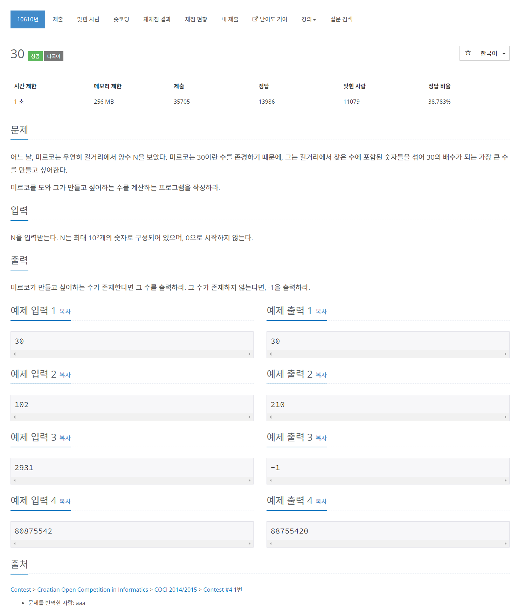

# [10610. 30](https://www.acmicpc.net/problem/10610)




### My Answer

```python
n = input()
if sum(int(x) for x in n)%3==0 and '0' in n : 
    print(''.join(sorted(n,reverse=True)))
else : 
    print(-1)
```

* Time Complexity : O(logn)
* Space Complexity : O(logn)


### The things I got
