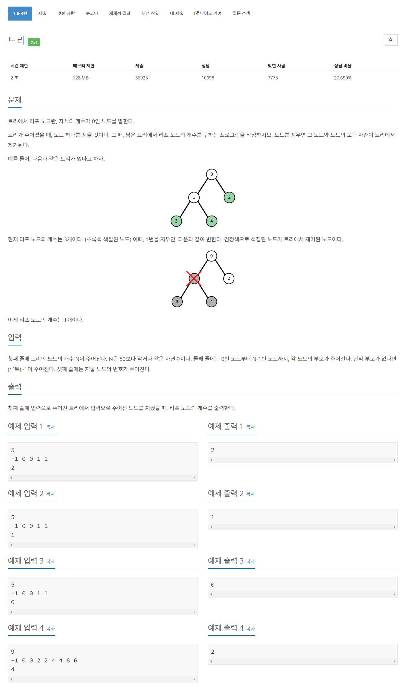

# [1068. 트리](https://www.acmicpc.net/problem/1068)




### My Answer

```python
def getInputs() :
    N = int(input())
    parents = list(map(int, input().split()))
    target = int(input())
    return N, parents, target

def makeTree(N, parents) :
    T = {i:[] for i in range(N)}
    for i,x in enumerate(parents):
        if x==-1: continue
        T[x].append(i)
    return T

def remove(T, target) :
    for child in T[target]:
        remove(T,child)
    T[target]=[-1]
    
N, parents, target = getInputs()
T = makeTree(N, parents)
remove(T, target)
count=0
for i in range(N) :
    if not T[i] or (len(T[i])==1 and T[i][0]==target) : 
        count+=1
print(count)
```

* Time Complexity : O(n)
* Space Complexity : O(n)


### The things I got
