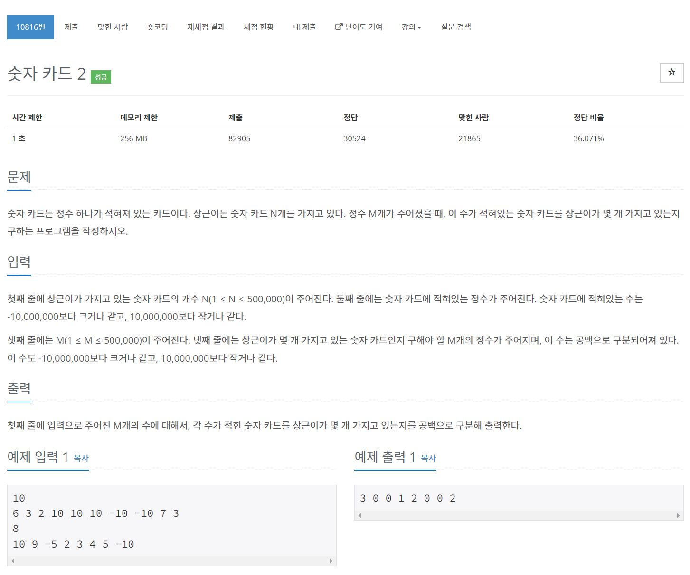

# [10816. 숫자 카드 2](https://www.acmicpc.net/problem/10816)




### My Answer

```python
from collections import Counter

_, count, _ = input(), Counter(list(map(int, input().split()))), input()

res = []
for x in list(map(int, input().split())) : 
    res.append(count[x])
print(*res)
```

* Time Complexity : O(n)
* Space Complexity : O(n)


### The things I got
