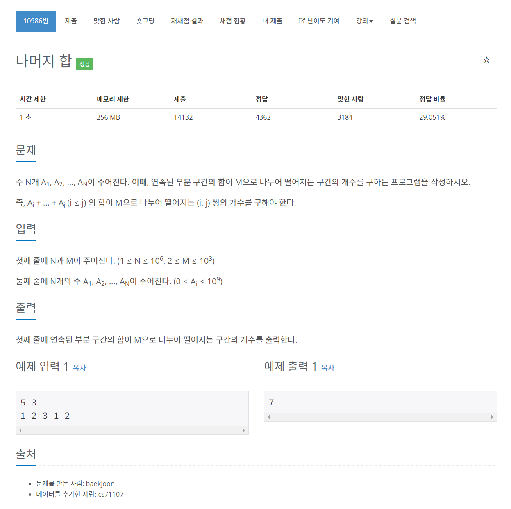

# [10986. 나머지 합](https://www.acmicpc.net/problem/10986)




### My Answer

```python
from collections import Counter

N,M = map(int,input().split())
arr = list(map(int,input().split()))

def remainSum(arr,m) : 
    
    # ready to make cumulative sum
    arr.insert(0,0)
    
    # apply cumulative and modulo
    for i in range(1,len(arr)) : 
        arr[i]+=arr[i-1]
        arr[i]%=m
        
    # count the number of modulo
    count = Counter(arr)
    
    # calculate modulo zero
    res = 0 
    for x in arr : 
        count[x]-=1
        res+=count[x]
    return res
    
print(remainSum(arr,M))
```

* Time Complexity : O(n)
* Space Complexity : O(n)


### The things I got
