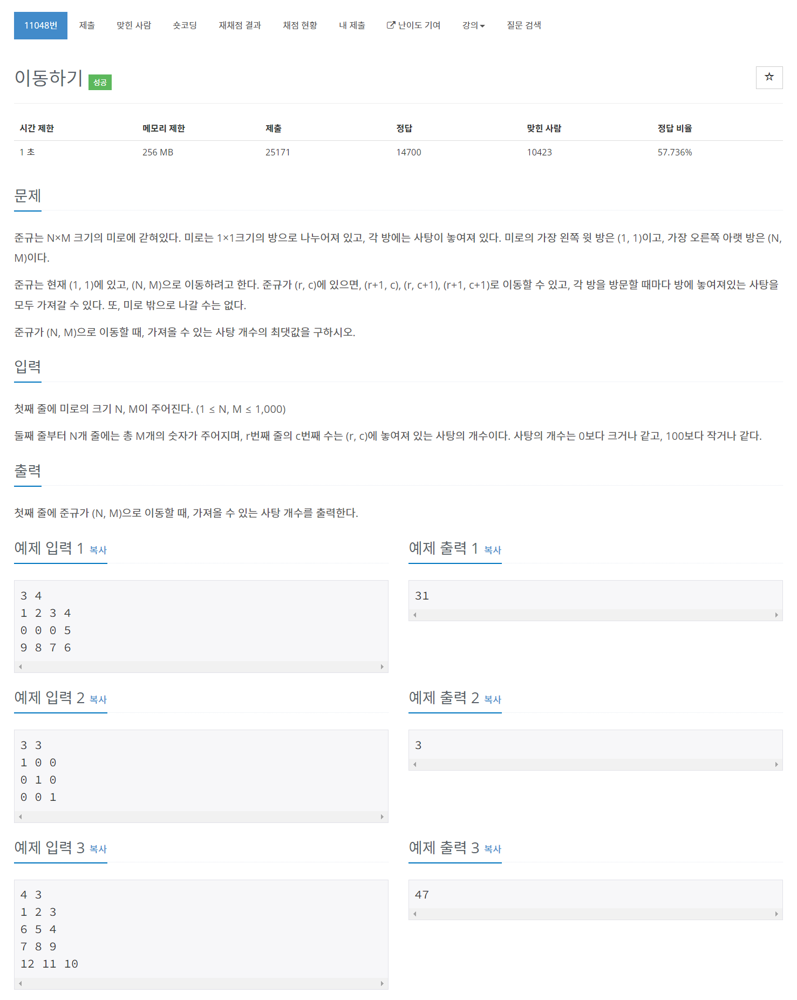

# [11048. 이동하기](https://www.acmicpc.net/problem/11048)




### My Answer

```python
import sys
input = sys.stdin.readline

n,m = map(int,input().split())
arr = [[0]*(m+1)] + [[0]+list(map(int,input().split())) for _ in range(n)]
for i in range(1,len(arr)) : 
    for j in range(1,len(arr[0])) : 
        arr[i][j] = max(arr[i-1][j-1],arr[i-1][j],arr[i][j-1])+arr[i][j]
    
print(arr[n][m])
```

* Time Complexity : O(n^2)
* Space Complexity : O(n^2)


### The things I got
