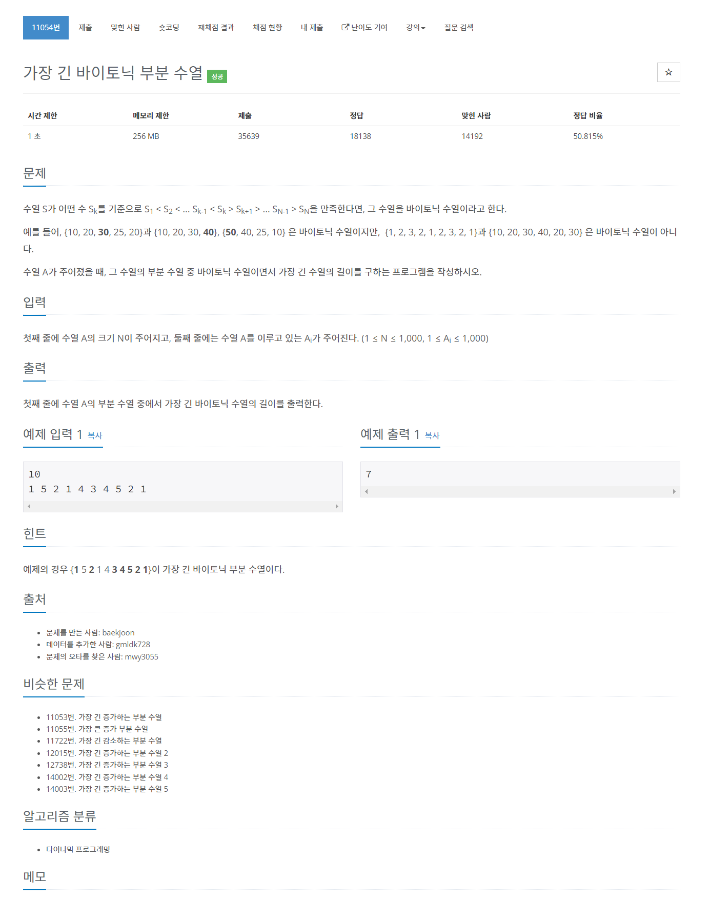

# [11054. 가장 긴 바이토닉 부분 수열](https://www.acmicpc.net/problem/11054)




### My Answer

```python
input()
arr = [int(x) for x in input().split()]

MAX = 0
left,right = [],[]

table = [0]*1004
for x in arr : 
    table[x]=max(table[:x])+1
    left.append(max(table[:x])+1)
    
table = [0]*1004
for x in arr[::-1] : 
    table[x]=max(table[:x])+1
    right.append(max(table[:x])+1)
    
right = right[::-1]
    
for i in range(len(left)) : 
    MAX = max(left[i]+right[i]-1,MAX)
    
print(MAX)
```

* Time Complexity : O(n)
* Space Complexity : O(1)


### The things I got

