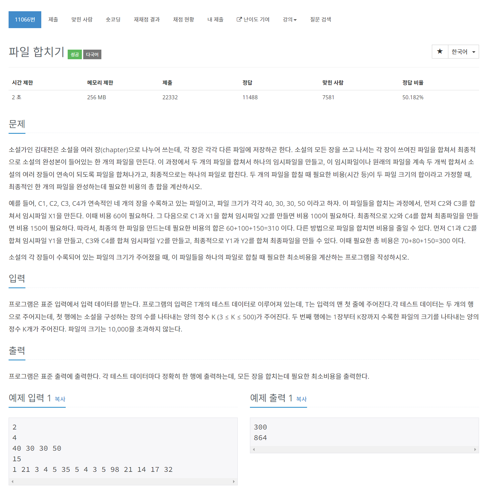

# [파일 합치기](https://www.acmicpc.net/problem/11066)




### My Answer

```python
import sys

for _ in range(int(input())) : 
    k = int(input())
    arr = tuple(map(int, input().split()))
    
    dp = [[0 for _ in range(k)] for _ in range(k)]
    for j in range(1,k) : 
        for i in range(j-1,-1,-1) : 
            if j-i==1 : 
                dp[i][j]=arr[i]+arr[j]
            else : 
                MIN = sys.maxsize
                for p in range(j-i) : 
                    MIN = min(dp[i][i+p]+dp[i+p+1][j], MIN)
                dp[i][j]=MIN+sum(arr[i:j+1])
    
    print(dp[0][-1])
```

* Time Complexity : O(n^2)
* Space Complexity : O(n^2)


### The things I got

