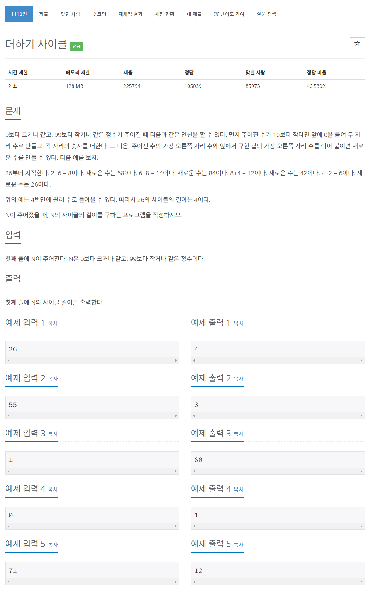

# [1110. 더하기 사이클](https://www.acmicpc.net/problem/1110)




### My Answer

```python
def changeNew(n) : 
    return n%10*10 + (n//10+n%10)%10

ori = int(input())
new = changeNew(ori)
count=1
while ori!=new : 
    new = changeNew(new)
    count+=1
print(count)
```

* Time Complexity : O(logn)
* Space Complexity : O(1)


### The things I got
