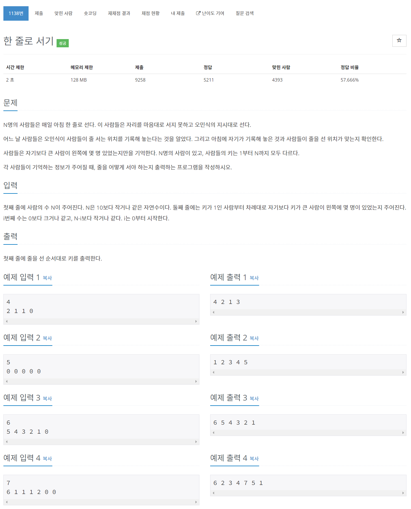

# [1138. 한 줄로 서기](https://www.acmicpc.net/problem/1138)




### My Answer

```python
n, arr = int(input()), list(map(int,input().split()))
nums = range(1,n+1)

res = []
for i in range(n-1,-1,-1) : 
    res.insert(arr[i],nums[i])
print(*res)
```

* Time Complexity : O(n^2)
* Space Complexity : O(n)


### The things I got
