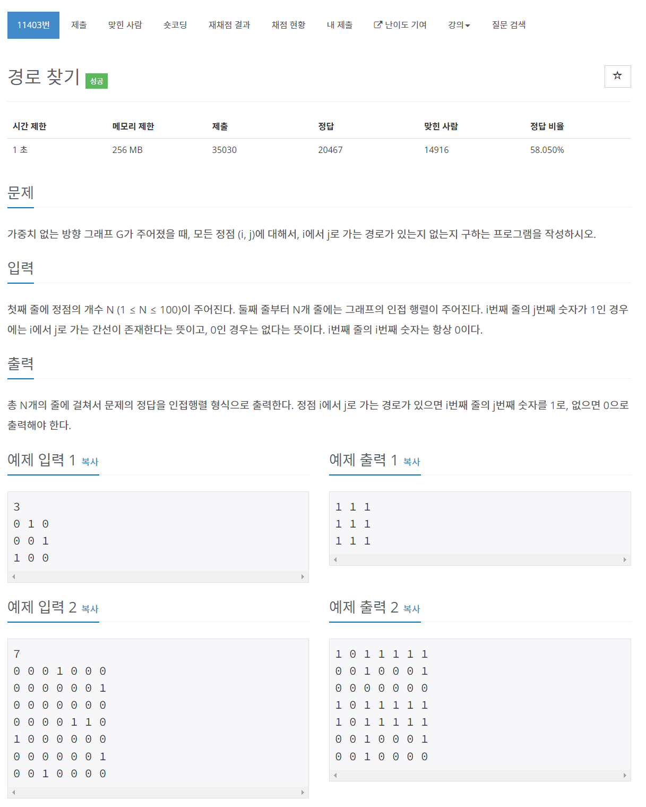

# [11403. 경로 찾기](https://www.acmicpc.net/problem/11403)




### My Answer

```python
import sys

sys.setrecursionlimit(1000000)
input = sys.stdin.readline


N = int(input())
matrix = [list(map(int,input().split())) for _ in range(N)]
visited = [[0 for _ in range(N)] for _ in range(N)]
        
def dfs(i) : 
    global matrix
    global visited
    
    res = set()
    for j in range(len(matrix[i])) : 
        if not matrix[i][j] or visited[i][j] : continue
        visited[i][j]=1
        dfs(j)
        for k in range(len(matrix[i])) : 
            matrix[i][k]|=matrix[j][k]
        
    return 

for i in range(N) : 
    dfs(i)
        
for x in matrix : 
    print(*x)
```

* Time Complexity : O(N^3)
* Space Complexity : O(N^2)


### The things I got
