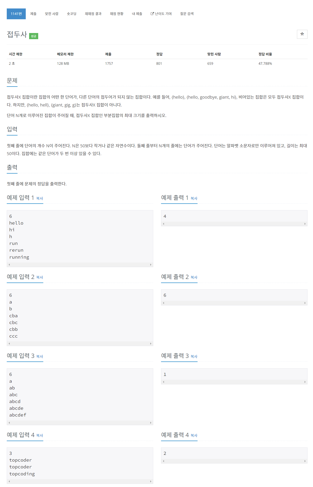

# [1141. 접두사](https://www.acmicpc.net/problem/1141)




### My Answer

```python
import sys

input = sys.stdin.readline

root = dict()

for _ in range(int(input())) : 
    s = list(input().rstrip())[::-1]
    head = root
    
    while s : 
        now = s.pop()
        if now not in head : 
            head[now]=dict()
        head = head[now]
        
def dfs(head) : 
    if len(head)==0 : 
        return 1
    
    count = 0
    for x in head : 
        count+=dfs(head[x])
    return count

print(dfs(root))
```

* Time Complexity : O(n*l)
* Space Complexity : O(n*l)


### The things I got
