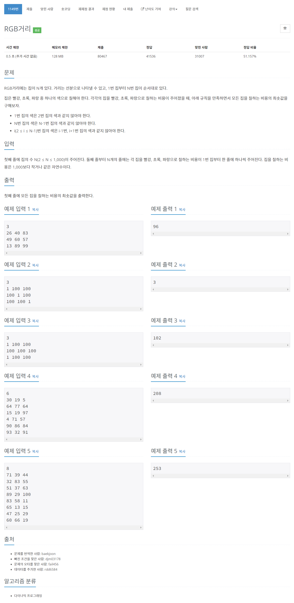

# [1149.RGB거리](https://www.acmicpc.net/problem/1149)




### My Answer

```python
import sys
N = int(input())
R,G,B = list(map(int,input().split()))
dp = [(R,G,B)]
for _ in range(N-1) : 
    R,G,B = list(map(int,sys.stdin.readline().split()))
    R_prev,G_prev,B_prev = dp[-1]
    R_new = min(G_prev+R,B_prev+R)
    G_new = min(R_prev+G,B_prev+G)
    B_new = min(R_prev+B,G_prev+B)
    dp.append((R_new,G_new,B_new))

print(min(dp[-1]))
```

* Time Complexity : O(n)

* Space Complexity : O(n)

  

### The things I got
