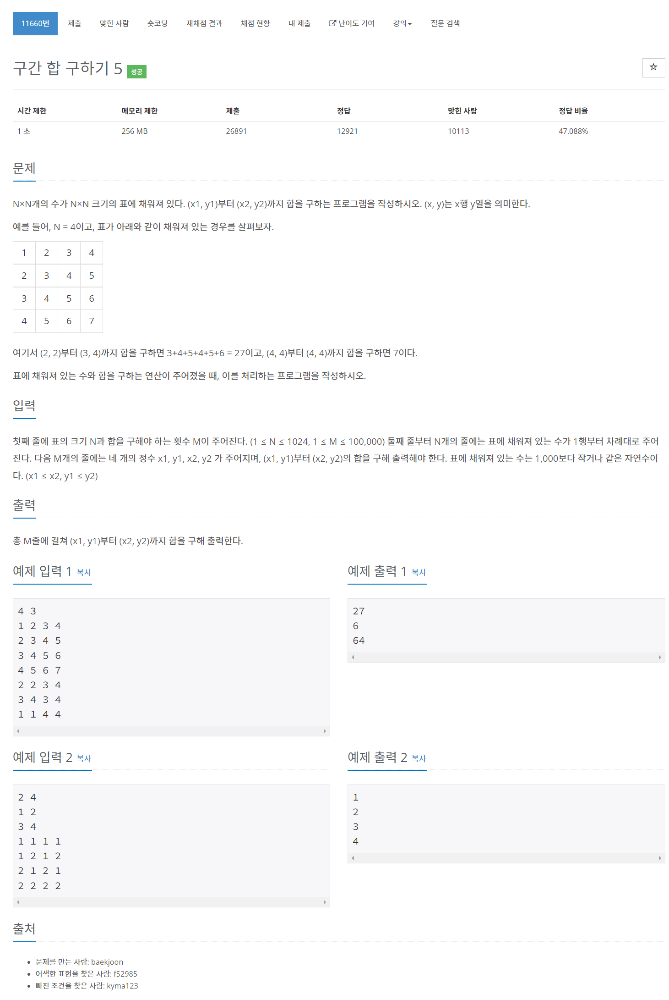

# [11660. 구간 합 구하기 5](https://www.acmicpc.net/problem/11660)




### My Answer

```python
import sys

input = sys.stdin.readline

n,m = map(int,input().split())
arr = [list(map(int,input().split())) for _ in range(n)]
for i in range(len(arr)) : 
    for j in range(len(arr[0])-1) : 
        arr[i][j+1]+=arr[i][j]
        
for j in range(len(arr[0])) : 
    for i in range(len(arr)-1) : 
        arr[i+1][j]+=arr[i][j]
        
arr = [[0]*(len(arr[0])+1)] + [[0]+x for x in arr]
for _ in range(m) : 
    i1,j1,i2,j2 = list(map(int,input().split()))
    print(arr[i2][j2]-arr[i1-1][j2]-arr[i2][j1-1]+arr[i1-1][j1-1])
    
```

* Time Complexity : O(n*m)
* Space Complexity : O(1)


### The things I got
