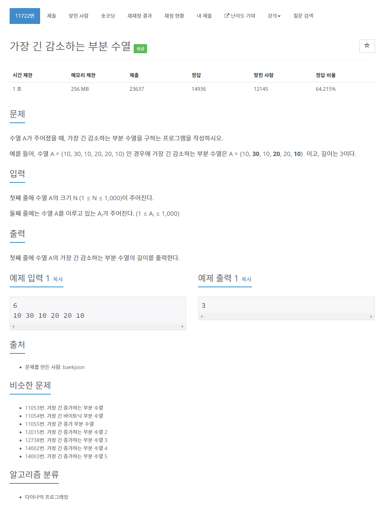

# [11722. 가장 긴 감소하는 부분 수열](https://www.acmicpc.net/problem/11722)




### My Answer

```python
import sys
sys.setrecursionlimit(10000)

n = int(input())
arr = [int(x) for x in input().split()]
visited = dict()

def dfs(last,n) : 
    global arr
    global visited
    
    if n==len(arr) : 
        return 0
    
    if (last,n) in visited : 
        return visited[(last,n)]
    
    res = 0
    if arr[n]<last : 
        res = max(res,dfs(arr[n],n+1)+1)
    res = max(res,dfs(last,n+1))
    
    visited[(last,n)] = res
    return res
    
print(dfs(1001,0))
```

* Time Complexity : O(2^n)
* Space Complexity : O(2^n)


### The things I got
