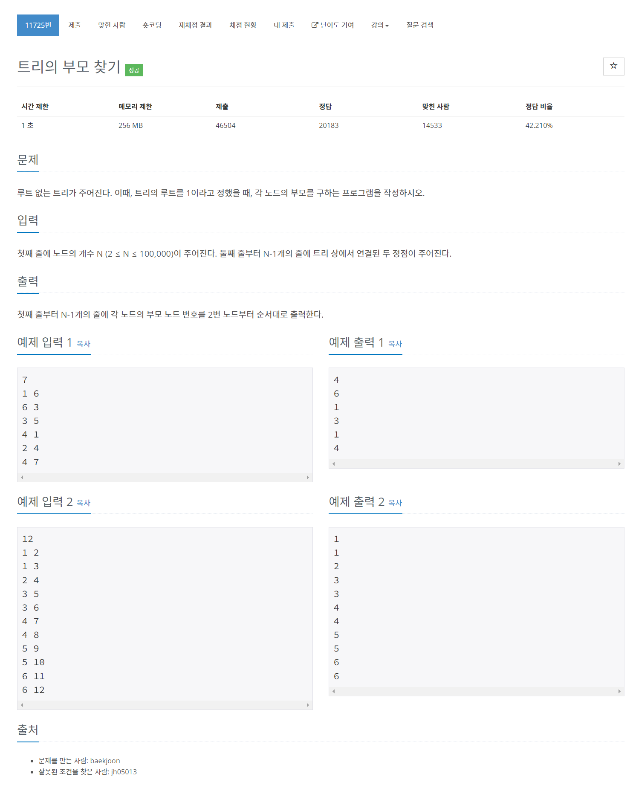

# [11725.트리의 부모 찾기](https://www.acmicpc.net/problem/11725)




### My Answer

```python
from collections import defaultdict
import sys
sys.setrecursionlimit(1000000)

input = sys.stdin.readline

n = int(input())
G = {i:set() for i in range(1,n+1)}

for _ in range(n-1) : 
    a,b = map(int,input().split())
    G[a].add(b)
    G[b].add(a)
    
parents = [0]*(n+1)

def dfs(now,prev) : 
    global G
    global parents
    
    parents[now]=prev
    for child in G[now] : 
        if child==prev : continue
        dfs(child,now)
        
dfs(1,0)
        
for x in parents[2:] : 
    print(x)
```

* Time Complexity : O(n)
* Space Complexity : O(n)


### The things I got
