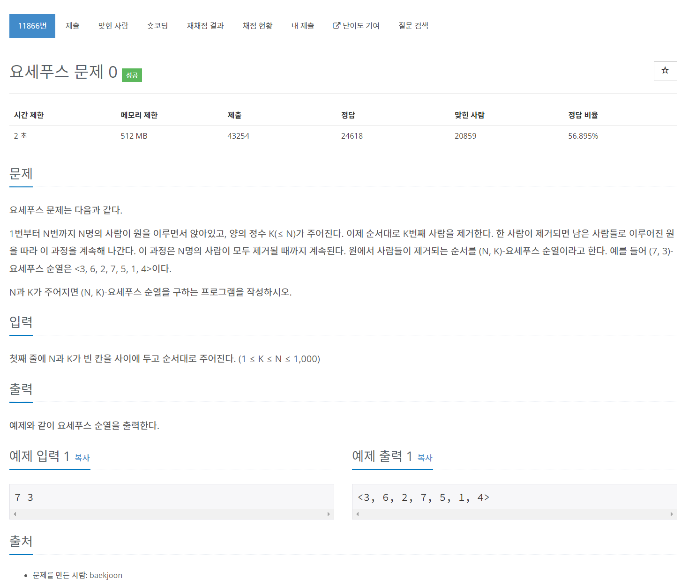

# [11866. 요세푸스 문제 0](https://www.acmicpc.net/problem/11866)




### My Answer

```python
n,k = map(int,input().split())
arr = list(range(1,n+1))
i=0
res = []
for _ in range(n) : 
    i=(i+k-1)%len(arr)
    res.append(arr.pop(i))
print('<'+str(res)[1:-1]+'>')
```

* Time Complexity : O(n^2)
* Space Complexity : O(n)


### The things I got
