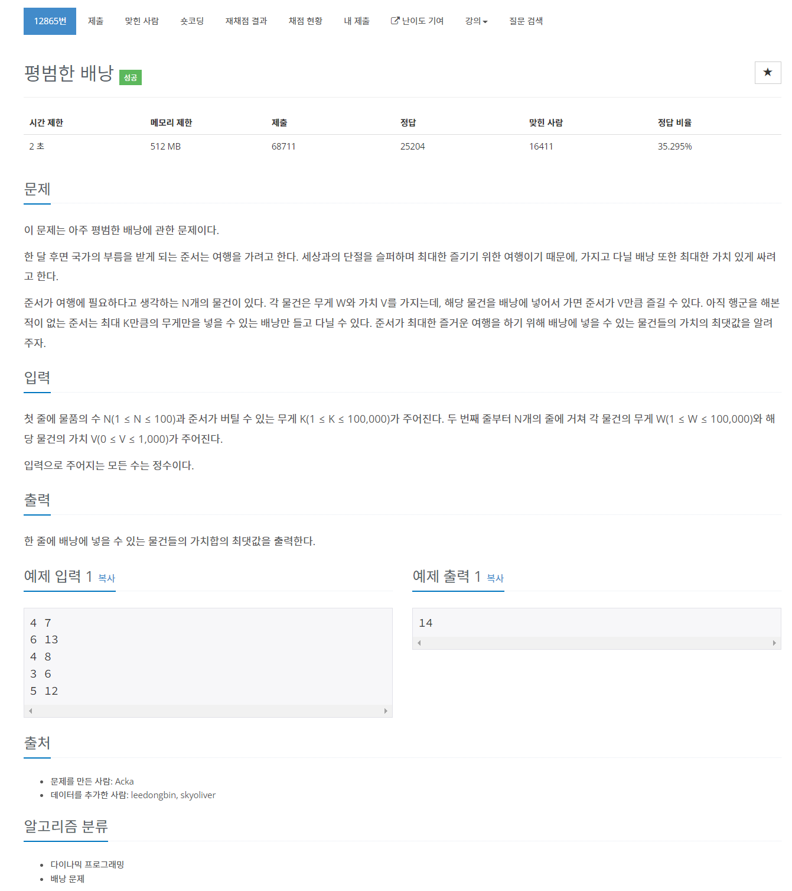

# [12865. 평범한 배낭](https://www.acmicpc.net/problem/12865)




### My Answer

```python
import sys
N,K = list(map(int,input().split()))
item = [list(map(int,sys.stdin.readline().split())) for _ in range(N)]
dp = [[0 for _ in range(K+1)] for _ in range(N+1)]
for i in range(1,len(dp)) : 
    for j in range(1,len(dp[0])) : 
        w,v = item[i-1]
        dp[i][j] = max(dp[i-1][j],dp[i][j-1])
        if j>=w : 
            dp[i][j] = max(dp[i][j],dp[i-1][j-w]+v)
        
print(dp[-1][-1])
```

* Time Complexity : O(n*k)
* Space Complexity : O(n*k)


### The things I got
