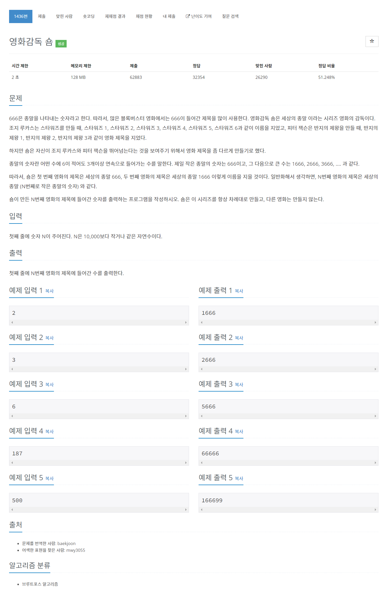

# [1436. 영화감독 숌](https://www.acmicpc.net/problem/1436)




### My Answer

```python
n = int(input())
dp = set(["666"])
while len(dp)<n+21 :
    temp = set()
    for x in dp : 
        for i in range(10) : 
            temp.add(str(i)+x)
            temp.add(x+str(i))
    dp = temp
    
dp = sorted([int(x) for x in dp])
print(dp[n-1])
```

* Time Complexity : O(n)
* Space Complexity : O(n)


### The things I got
