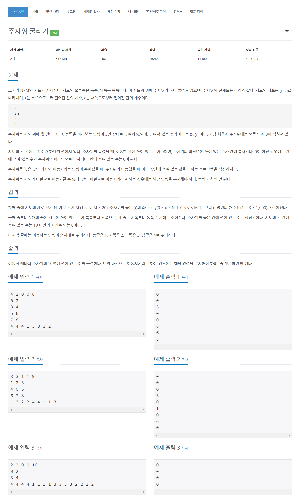

# [14499. 주사위 굴리기](https://www.acmicpc.net/problem/14499)




### My Answer

```python
import sys
input = sys.stdin.readline

N,M,y,x,K = list(map(int,input().split()))
Map = [list(map(int,input().split())) for _ in range(N)]
operation = list(map(int,input().split()))

def rotateDice(dice,direction) : 
    if direction==1 : #right
        dice["bottom"], dice["west"], dice["top"], dice["east"] = dice["east"], dice["bottom"], dice["west"], dice["top"]
    elif direction==2 : #left
        dice["bottom"], dice["west"], dice["top"], dice["east"] = dice["west"], dice["top"], dice["east"], dice["bottom"]
    elif direction==3 : #up
        dice["bottom"], dice["south"], dice["top"], dice["north"] = dice["north"], dice["bottom"], dice["south"], dice["top"]
    elif direction==4 : #down
        dice["bottom"], dice["south"], dice["top"], dice["north"] = dice["south"], dice["top"], dice["north"], dice["bottom"] 
    else : 
        raise(Exception("wrong direction!"))
    
def move(N,M,x,y,direction) : 
    original = (x,y)
    if direction==1 : # right
        x+=1
    elif direction==2 : # left
        x-=1
    elif direction==3 : # north
        y-=1
    elif direction==4 : 
        y+=1
    moved = (x,y)
    
    if y<0 or y>=N or x<0 or x>=M :
        return False, *original
    else : 
        return True, *moved
    
dice = {"bottom":0, "top":0, "west":0, "north":0, "south":0, "east":0}
for direction in operation : 
    movable, x,y = move(N,M,x,y,direction)
    if not movable : continue
    rotateDice(dice,direction)
    if Map[y][x]==0 : 
        Map[y][x]=dice["bottom"]
    else : 
        dice["bottom"] = Map[y][x]
        Map[y][x]=0
    print(dice["top"])
```

* Time Complexity : O(n*m)
* Space Complexity : O(n*m)


### The things I got
