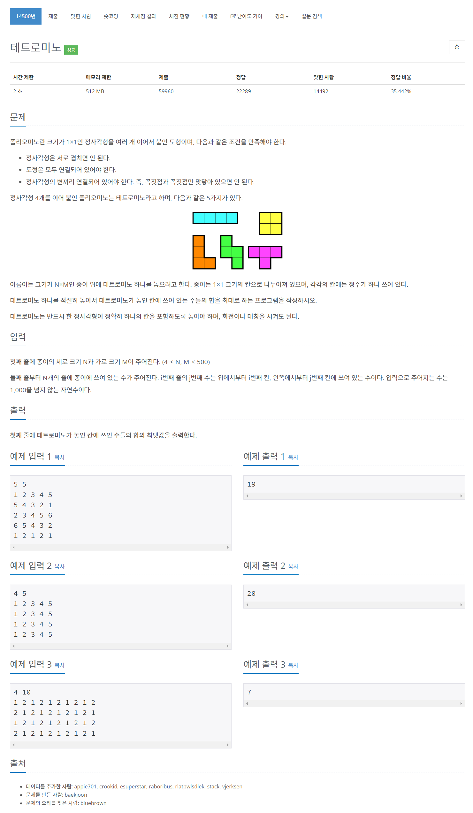

# [14500. 테트로미노](https://www.acmicpc.net/problem/14500)




### My Answer

```python
import sys
input = sys.stdin.readline

N,M = list(map(int,input().split()))
paper = [list(map(int,input().split())) for _ in range(N)]

res = 0
for i in range(N) : 
    for j in range(M) : 
        # bar
        if i<N-3 : 
            res = max(paper[i][j]+paper[i+1][j]+paper[i+2][j]+paper[i+3][j],res)
        if j<M-3 : 
            res = max(sum(paper[i][j:j+4]),res)
        # square
        if i<N-1 and j<M-1 : 
            res = max(sum(paper[i][j:j+2])+sum(paper[i+1][j:j+2]),res)
            
        # 2*3 box
        if i<N-1 and j<M-2 : 
            base = sum(paper[i][j:j+3])+sum(paper[i+1][j:j+3])
            for m in range(2) : 
                for n in range(2) : 
                    res = max(base-paper[i+m][j+n]-paper[i+m][j+n+1],res) # ㄱ shape
                    res = max(base-paper[i+m][j]-paper[i+n][j+2],res) # Z,ㅗ shape
                    
        # 3*2 box
        if i<N-2 and j<M-1 : 
            base = sum(paper[i][j:j+2])+sum(paper[i+1][j:j+2])+sum(paper[i+2][j:j+2])
            for m in range(2) : 
                for n in range(2) : 
                    res = max(base-paper[i+m][j+n]-paper[i+m+1][j+n],res) # ㄱ shape
                    res = max(base-paper[i][j+n]-paper[i+2][j+m],res) # Z,ㅗ shape

print(res)
```

* Time Complexity : O(n*m)
* Space Complexity : O(n*m)


### The things I got
