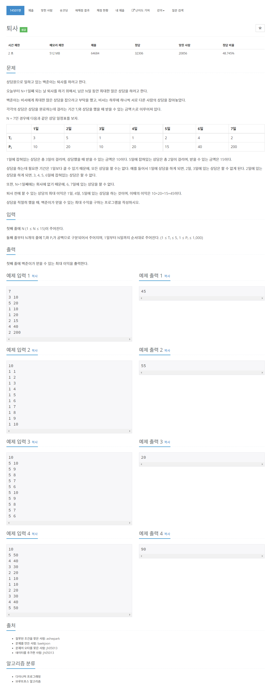

# [14501. 퇴사](https://www.acmicpc.net/problem/14501)




### My Answer

```python
import sys
N = int(input())
array = [list(map(int,sys.stdin.readline().split())) for _ in range(N)][::-1]
dp = [[0 for _ in range(N+1)] for _ in range(N+1)]
for i in range(1,N+1) : 
    for j in range(1,N+1) : 
        T, P = array[i-1]
        dp[i][j] = dp[i-1][j-1]
        if T<i+1 : 
            dp[i][0] = max(dp[i][T:i+1])+P
        
print(max(dp[-1]))
```

* Time Complexity : O(n^2)
* Space Complexity : O(n^2)


### The things I got

