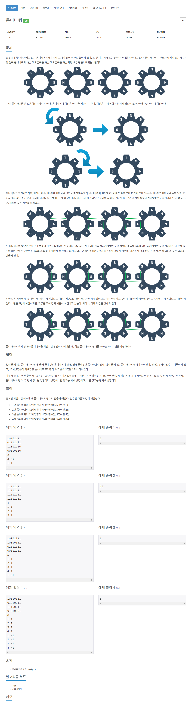

# [14891. 톱니바퀴](https://www.acmicpc.net/problem/14891)




### My Answer

```python
import sys
input = sys.stdin.readline

def rotate(wheel, direct) : 
    if direct==1 : 
        return [wheel[-1]]+wheel[:-1]
    else : 
        return wheel[1:]+[wheel[0]]

wheels = [list(map(int,list(input().strip()))) for _ in range(4)]
for _ in range(int(input())) : 
    n,d = map(int,input().split())    
    
    # left : wheel[6], right : wheel[2]
    directions = [0,0,0,0]
    
    #left
    left_n, left_d = n,d
    while left_n-1>0 and wheels[left_n-2][2]!=wheels[left_n-1][6] : 
        #wheels[left_n-2]=rotate(wheels[left_n-2],-left_d)
        directions[left_n-2]=-left_d
        left_n-=1
        left_d*=-1
        
    #right
    right_n, right_d = n,d
    while right_n-1<3 and wheels[right_n-1][2]!=wheels[right_n][6] : 
        #wheels[right_n]=rotate(wheels[right_n],-right_d)
        directions[right_n]=-right_d
        right_n+=1
        right_d*=-1
        
    directions[n-1]=d
    
    for i in range(4) : 
        if directions[i]==0 : continue
        wheels[i] = rotate(wheels[i],directions[i])
    
print(sum(x[0]*2**i for i,x in enumerate(wheels)))
```

* Time Complexity : O(n)
* Space Complexity : O(1)


### The things I got
