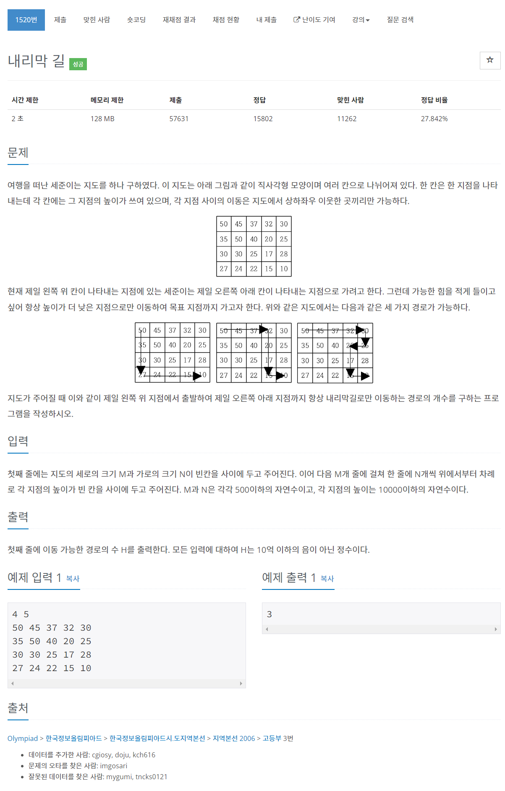

# [1520. 내리막길](https://www.acmicpc.net/problem/1520)




### My Answer

```python
import sys
sys.setrecursionlimit(10000)
input = sys.stdin.readline
n,m = map(int,input().split())
arr = [list(map(int,input().split())) for _ in range(n)]
visited = dict()

def dfs(i,j) : 
    global n,m
    global arr
    global visited
    
    if (i,j) == (n-1,m-1) : 
        return 1
    
    if (i,j) in visited : 
        return visited[(i,j)]
    
    res = 0
    if i>0 and arr[i-1][j] < arr[i][j] : 
        res += dfs(i-1,j)
    if i<n-1 and arr[i+1][j] < arr[i][j] : 
        res += dfs(i+1,j)
    if j>0 and arr[i][j-1] < arr[i][j] : 
        res += dfs(i,j-1)
    if j<m-1 and arr[i][j+1] < arr[i][j] : 
        res += dfs(i,j+1)
    
    visited[(i,j)] = res
    return res

print(dfs(0,0))
```

* Time Complexity : O(n*m)
* Space Complexity : O(n*m)


### The things I got
