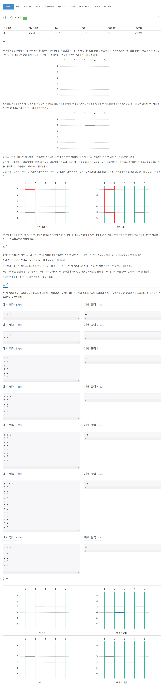

# [15684. 사다리 조작](https://www.acmicpc.net/problem/15684)




### My Answer

```python
import sys

input = sys.stdin.readline

def playStairs(matrix,start) : 
    end = start
    #print(end)
    for i in range(1,len(matrix)) : 
        if matrix[i][end]==1 : 
            end+=1
        elif matrix[i][end-1]==1 : 
            end-=1
        #print(end)
    return start==end

N,M,H = list(map(int,input().split()))

matrix = [[0 for _ in range(N+1)] for _ in range(H+1)]
for _ in range(M) : 
    a,b = map(int,input().split())
    matrix[a][b]=1
    
candidate = [None,None,None]
for i in range(1,len(matrix)) : 
    for j in range(1,len(matrix[0])-1) : 
        if matrix[i][j]==1 : continue
        if 1<j and matrix[i][j-1]==1 : continue
        if matrix[i][j+1]==1 : continue
        candidate.append((i,j))

res = 4
count = 0
for a in range(len(candidate)) : 
    if candidate[a] : 
        a1,a2 = candidate[a]
        if matrix[a1][a2]==1 : continue
        elif matrix[a1][a2-1]==1 : continue
        elif matrix[a1][a2+1]==1 : continue
            
        matrix[a1][a2]=1
        count+=1
        
    for b in range(a+1,len(candidate)) : 
        
        if candidate[b] : 
            b1,b2 = candidate[b]
            if matrix[b1][b2]==1 or matrix[b1][b2-1]==1 or matrix[b1][b2+1]==1: continue
            matrix[b1][b2]=1
            count+=1
        
        for c in range(b+1, len(candidate)) : 
            if candidate[c] : 
                c1,c2 = candidate[c]
                if matrix[c1][c2]==1 or matrix[c1][c2-1]==1 or matrix[c1][c2+1]==1: continue
                matrix[c1][c2]=1
                count+=1
                
            if all([playStairs(matrix,i) for i in range(1,N+1)]) : 
                res = min(res,count)
            
            if candidate[c] : 
                c1,c2 = candidate[c]
                matrix[c1][c2]=0
                count-=1
        if candidate[b] : 
            b1,b2 = candidate[b]
            matrix[b1][b2]=0
            count-=1
    if candidate[a] : 
        a1,a2 = candidate[a]
        matrix[a1][a2]=0
        count-=1
    
if res==4 : res=-1
print(res)
```

* Time Complexity : O(h*n^3)
* Space Complexity : O(n*h)


### The things I got
