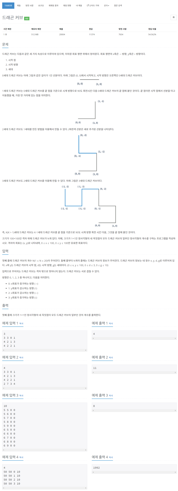

# [15685. 드래곤 커브](https://www.acmicpc.net/problem/15685)




### My Answer

```python
def nextGenCurve(curve) : 
    return curve + [(x+1)%4 for x in curve[::-1]]
    
def followCurve(matrix, curve, x, y) : 
    
    matrix[y][x]=1
    
    for d in curve : 
        if d==0 : 
            x+=1
        elif d==1 : 
            y-=1
        elif d==2 : 
            x-=1
        else : 
            y+=1
            
        matrix[y][x]=1
        
    return    
    
    
def calculateRec(matrix) : 
    res = 0
    for i in range(100) : 
        for j in range(100) : 
            if matrix[i][j] & matrix[i+1][j] & matrix[i][j+1] & matrix[i+1][j+1] : 
                res+=1 
    return res
    
matrix = [[0 for _ in range(101)] for _ in range(101)]
for _ in range(int(input())) : 
    x,y,d,g = list(map(int, input().split()))
    
    # calculate dragon curve by gen
    curve = [d]
    for _ in range(g) : 
        curve = nextGenCurve(curve)
    
    # follow curve and save points
    followCurve(matrix, curve, x, y)
    
# calculate Rectangular
res = calculateRec(matrix)
print(res)
```

* Time Complexity : O(2^g*n+101^2)
* Space Complexity : O(2^g)


### The things I got
