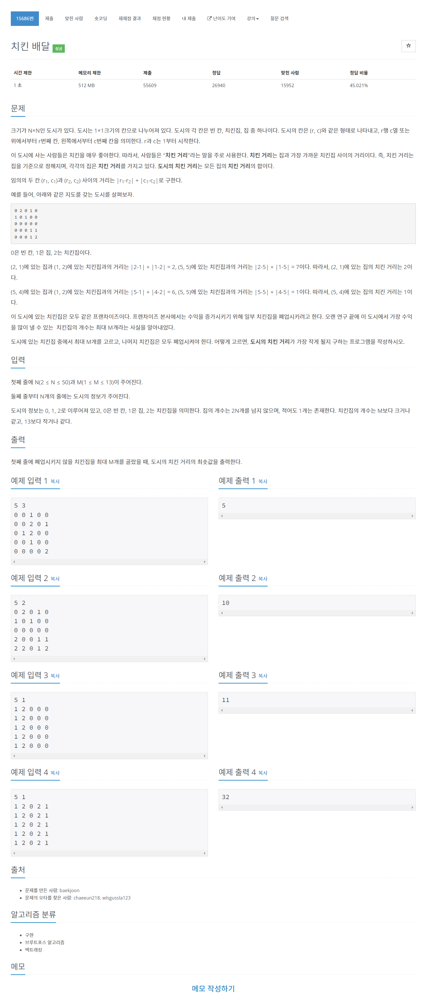

# [15686. 치킨 배달](https://www.acmicpc.net/problem/15686)




### My Answer

```python
from itertools import combinations
import sys

n,m = list(map(int, input().split()))
arr = [list(map(int, input().split())) for _ in range(n)]

chickens = []
homes = []
for i in range(n) : 
    for j in range(n) : 
        if arr[i][j]==1 : 
            homes.append((i,j))
        elif arr[i][j]==2 : 
            chickens.append((i,j))
    
res = sys.maxsize
for comb in combinations(chickens,m) : 
    temp = 0
    for x in homes : 
        minimum = 2*n*n
        for c in comb : 
            minimum=min(abs(c[0]-x[0])+abs(c[1]-x[1]),minimum)
        temp += minimum
    res = min(res,temp)

print(res)
```

* Time Complexity : O(nPm)
* Space Complexity : O(n+m)


### The things I got
