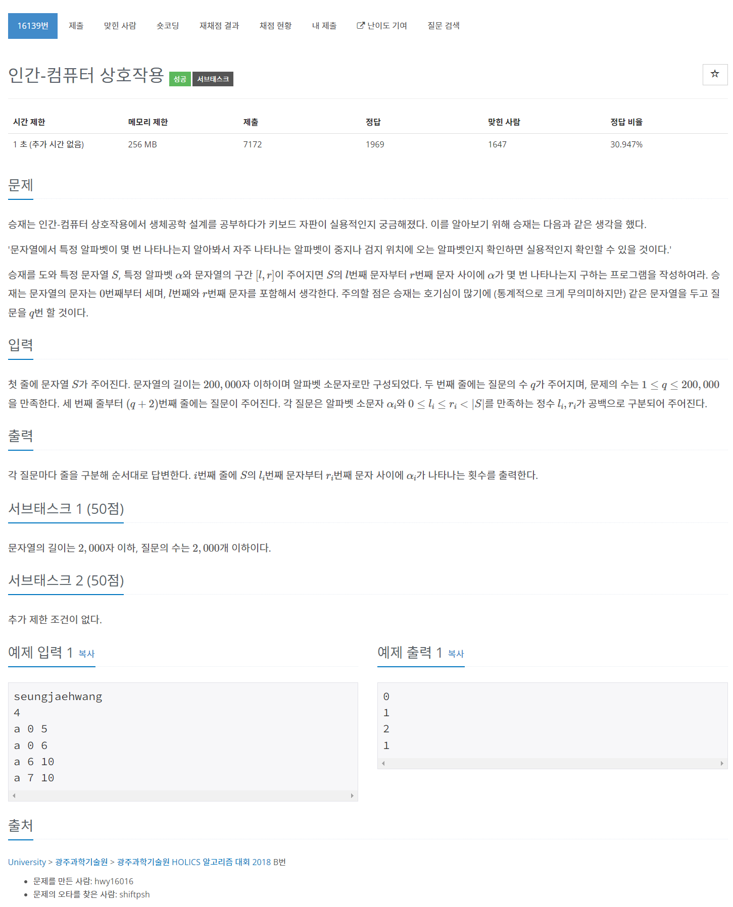

# [16139. 인간-컴퓨터 상호작용](https://www.acmicpc.net/problem/16139)




### My Answer

```python
import sys
input = sys.stdin.readline

s = input().strip()
now = [0 for _ in range(26)]
counts = [now[:]]

for x in s : 
    now[ord(x)-97]+=1
    counts.append(now[:])

for _ in range(int(input())) : 
    a, l, r = input().split()
    res = counts[int(r)+1][ord(a)-97]-counts[int(l)][ord(a)-97]
    print(res)
```

* Time Complexity : O(N+M)
* Space Complexity : O(N+M)


### The things I got
