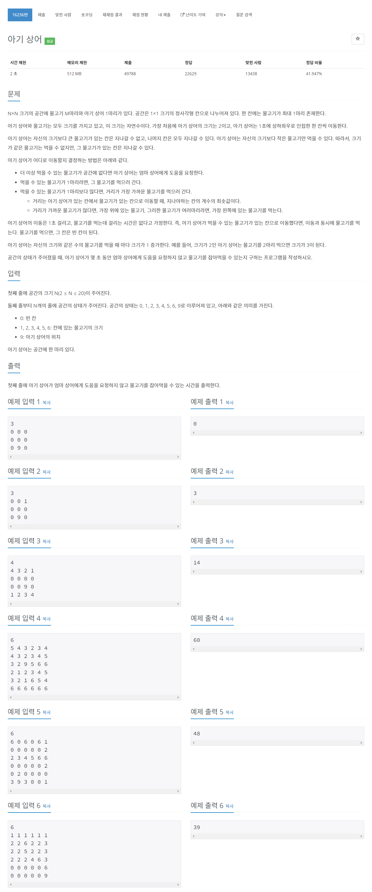

# [16236. 아기 상어](https://www.acmicpc.net/problem/16236)




### My Answer

```python
from collections import deque

def getInputs() :
    n = int(input())
    space = [list(map(int,input().rstrip().split())) for _ in range(n)]
    return n, space

def initSharkPlace(space,deq) :
    for i in range(len(space)) :
        for j in range(len(space[0])) :
            if space[i][j]==9 :
                deq.append((i,j,0))
                space[i][j]=0
                return

def eatClosestFish(space,shark_size,deq) :
    n = len(space)

    # ready for traverse
    di, dj = (1,-1,0,0), (0,0,1,-1)
    min_time, target_i, target_j = n**2, n, n
    visited = [[False for _ in range(n)] for _ in range(n)]

    while deq :
        i,j,time = deq.popleft()
        #print(i,j,"time",time)
        visited[i][j]=True

        # update target fish
        if space[i][j] and space[i][j]<shark_size :
            if min_time>time \
                or min_time==time and target_i>i \
                or min_time==time and target_i==i and target_j>j :

                min_time=time
                target_i=i
                target_j=j
            #continue

        for k in range(4) :
            ni,nj = i+di[k], j+dj[k]

            # exception 1 : index overflow
            if not(0<=ni<n) or not(0<=nj<n) : continue

            # exception 2 : already visited, fish is bigger than shark
            if visited[ni][nj] or space[ni][nj]>shark_size : continue

            visited[ni][nj]=True
            deq.append((ni,nj,time+1))

    #print("mintime, target",min_time, target_i, target_j)
    # if there are no eatable fish, exit
    if min_time==n**2 : return -1

    # remove eaten fish and init the place to the deque
    space[target_i][target_j]=0
    deq.append((target_i,target_j,0))
    return min_time

def babyShark(n,space):

    # deque for bfs
    deq = deque()
    initSharkPlace(space,deq)

    # shark info
    shark_size=2
    total_time=0
    count=0
    # start process
    while True :
        time = eatClosestFish(space,shark_size,deq)

        # exit condition : time == -1 (no eatable fish)
        if time==-1 : return total_time

        # do count
        total_time+=time
        count+=1
        if count==shark_size :
            shark_size+=1
            count=0

    return -1


# Press the green button in the gutter to run the script.
if __name__ == '__main__':
    #sys.stdin = open('input6.txt','r')
    
    n, space = getInputs()
    res = babyShark(n,space)
    if res==-1 :
        raise(Exception("Somethings wrong...", n, space))
    else :
        print(res)

# See PyCharm help at https://www.jetbrains.com/help/pycharm/

```

* Time Complexity : O(n**4)
* Space Complexity : O(n**2)


### The things I got
