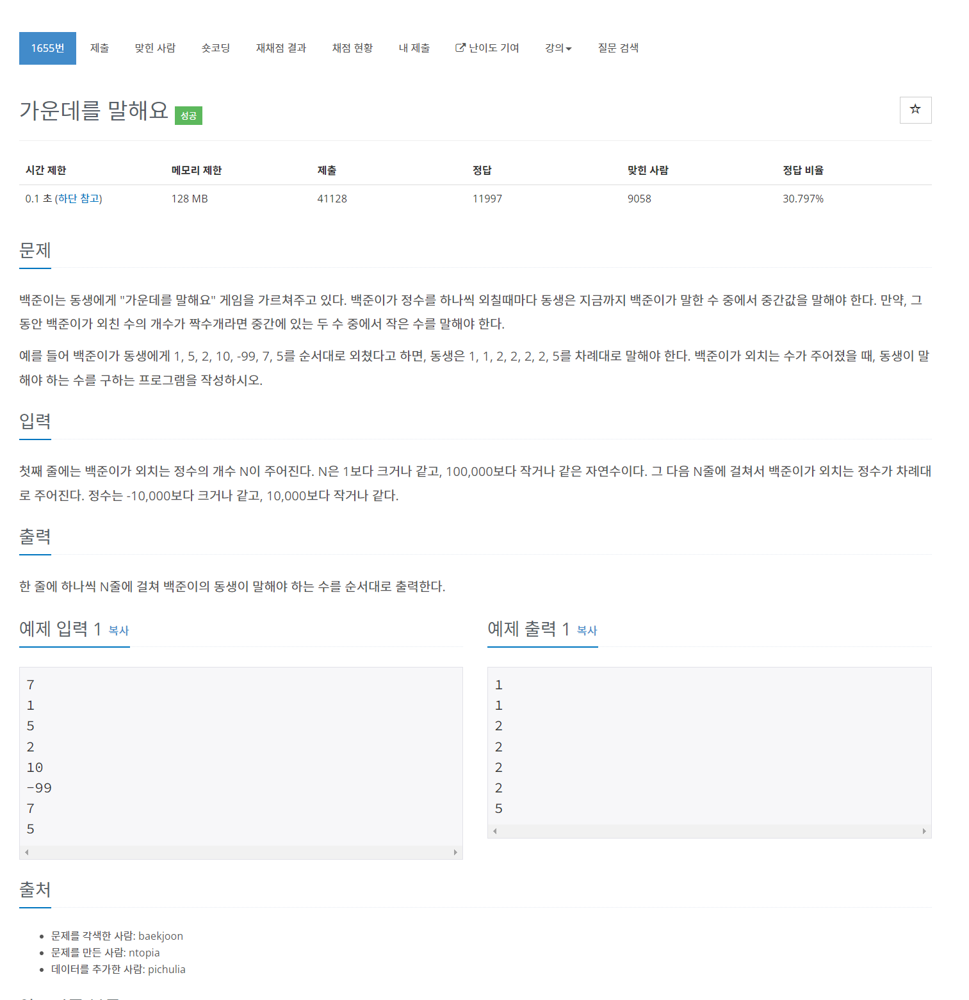

# [1655. 가운데를 말해요](https://www.acmicpc.net/problem/1655)




### My Answer

```python
import heapq
import sys

input = sys.stdin.readline

smaller = [] # max_heap
bigger = [] # min_heap
for _ in range(int(input())) : 
    n = int(input())
    if (smaller and bigger and smaller[0][1]<=n<=bigger[0]) or not smaller or not bigger :
        if smaller :
            if smaller[0][1]>n : 
                heapq.heappush(smaller,(-n,n))
            else : 
                heapq.heappush(bigger,n)
        elif bigger : 
            if bigger[0]<n :
                heapq.heappush(bigger,n)
            else : 
                heapq.heappush(smaller,(-n,n))
        else : 
            heapq.heappush(smaller,(-n,n))
            
    elif smaller[0][1]>n : 
        heapq.heappush(smaller,(-n,n))
        
    elif bigger[0]<n : 
        heapq.heappush(bigger,n)
        
    else : 
        raise(Exception("Wrong condition","n",n,(smaller, bigger)))
    
    if len(smaller)-len(bigger)==2 : 
        heapq.heappush(bigger,heapq.heappop(smaller)[1])
    elif len(bigger)-len(smaller)==2 : 
        poped = heapq.heappop(bigger)
        heapq.heappush(smaller,(-poped,poped))
    
    if len(smaller)>=len(bigger) : 
        print(smaller[0][1])
    else : 
        print(bigger[0])
        
        
```

* Time Complexity : O(nlogn)
* Space Complexity : O(n)


### The things I got
