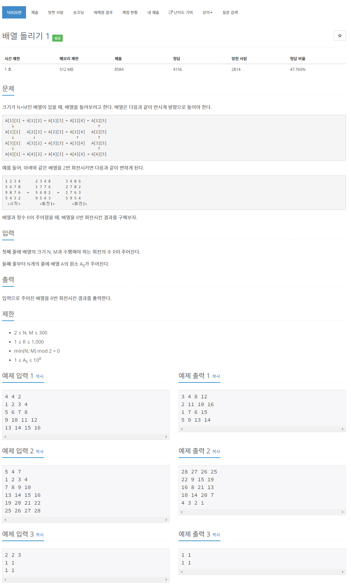

# [16926. 배열 돌리기 1](https://www.acmicpc.net/problem/16926)




### My Answer

```python
import sys
input = sys.stdin.readline

N,M,R = list(map(int,input().split()))
table = [list(map(int,input().split())) for _ in range(N)]

def sequence(table) : 
    
    res = []
    
    left,right = 0, len(table[0])-1
    top, bottom = 0, len(table)-1
    
    while left<=right and top<=bottom : 
        
        seq = []
        
        if left==right and top==bottom : break
        # top row
        for i in range(right-left) : 
            seq.append((top,left+i))

        # right col
        for i in range(bottom-top) : 
            seq.append((top+i,right))

        # bottom row
        for i in range(right-left,0,-1) : 
            seq.append((bottom,left+i))

        # left col
        for i in range(bottom-top,0,-1) : 
            seq.append((top+i,left))
                
        left, right = left+1, right-1
        top, bottom = top+1, bottom-1
        
        res.append(seq)
        
    return res
    
def rotate(seq, R) : 
    rotated = []
    for i in range(len(seq)) : 
        pivot = len(seq[i])-R%len(seq[i])
        rotated.append(seq[i][pivot:]+seq[i][:pivot])
    return rotated

def makeResultTable(table) : 
    return [[0 for _ in range(len(table[0]))] for _ in range(len(table))]

def applySeq(table, res, seq, rotated) : 
    for si in range(len(seq)) : 
        for sj in range(len(seq[si])) :
            seq_i,seq_j = seq[si][sj]
            rot_i, rot_j = rotated[si][sj]
            res[rot_i][rot_j]=table[seq_i][seq_j]
        
def printTable(table) : 
    for x in table : 
        print(*x)

seq = sequence(table)
rotated = rotate(seq,R)
res = makeResultTable(table)
applySeq(table,res,seq,rotated)
printTable(res)
```

* Time Complexity : O(n*m)
* Space Complexity : O(n*m)


### The things I got
