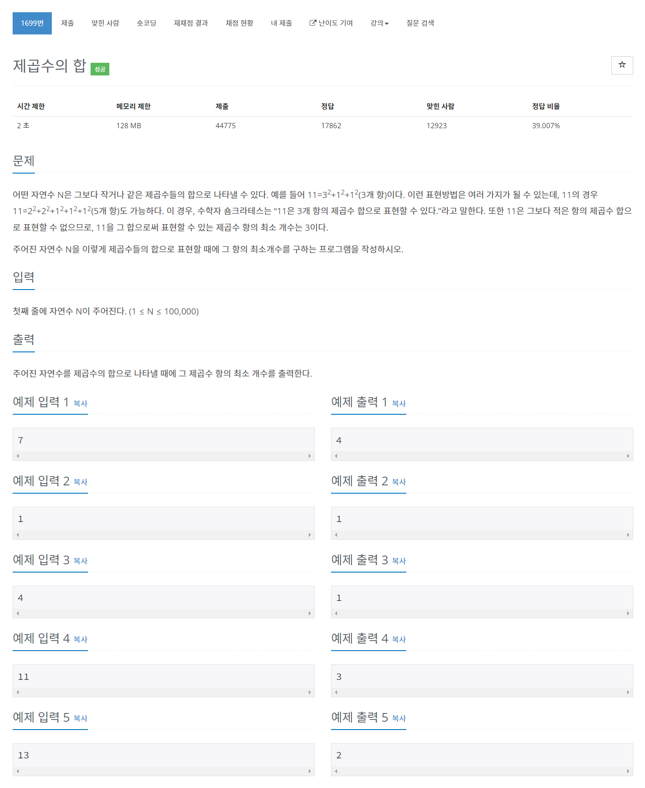

# [1699. 제곱수의 합](https://www.acmicpc.net/problem/1699)




### My Answer

```python
n = int(input())
dp = {}

def dfs(n) : 
    global dp
    if n<4 : 
        return n
    
    if n in dp : 
        return dp[n]
    
    res = n
    for i in range(int(n**.5),1,-1) :
        res = min(res, dfs(n-i**2)+1)
    
    dp[n]=res
    return res

print(dfs(n))
```

* Time Complexity : O(n)
* Space Complexity : O(n)


### The things I got
