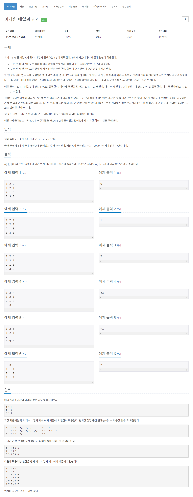

# [17140. 이차원 배열과 연산](https://www.acmicpc.net/problem/17140)




### My Answer

```python
from collections import deque, Counter
import sys

input = sys.stdin.readline

def customSort(arr) : 
    counter = Counter(arr)
    if 0 in counter : #remove 0
        del counter[0] 
        
    counter = sorted([(v,k) for k,v in counter.items()])
    res = []
    for x in counter : 
        res.append(x[1])
        res.append(x[0])
    return res
    
def R_operation(matrix) : 
    # implement sort
    for i in range(len(matrix)) : 
        matrix[i] = customSort(matrix[i])
    
    max_len = max(len(x) for x in matrix) # check maximum length of row
    max_len = min(100, max_len) # row should not be over 100
    
    # fill empty with zero or cut overflowed values
    for i in range(len(matrix)) : 
        if len(matrix[i])<max_len : # lower than max_len
            matrix[i] = matrix[i] + [0]*(max_len-len(matrix[i]))
        elif len(matrix[i])>max_len : # overflowed than 100
            matrix[i] = matrix[i][:100]
            
    return matrix

def C_operation(matrix) : 
    matrix = R_operation(list(zip(*matrix)))
    return [list(x) for x in zip(*matrix)]


r,c,k = list(map(int,input().split()))
r,c = r-1, c-1 # r,c starts from 1
matrix = [list(map(int,input().split())) for _ in range(3)]

def calculation(r,c,k,matrix) : 
    for time in range(101) :        
        # check end condition
        if r<len(matrix) and c<len(matrix[0]) and matrix[r][c]==k : 
            return time

        # R operation
        if len(matrix)>=len(matrix[0]) : 
            matrix = R_operation(matrix)
        # C operation
        else :
            matrix = C_operation(matrix)
    return -1
    
print(calculation(r,c,k,matrix))
```

* Time Complexity : O(n) 100
* Space Complexity : O(1) (3*3)


### The things I got
