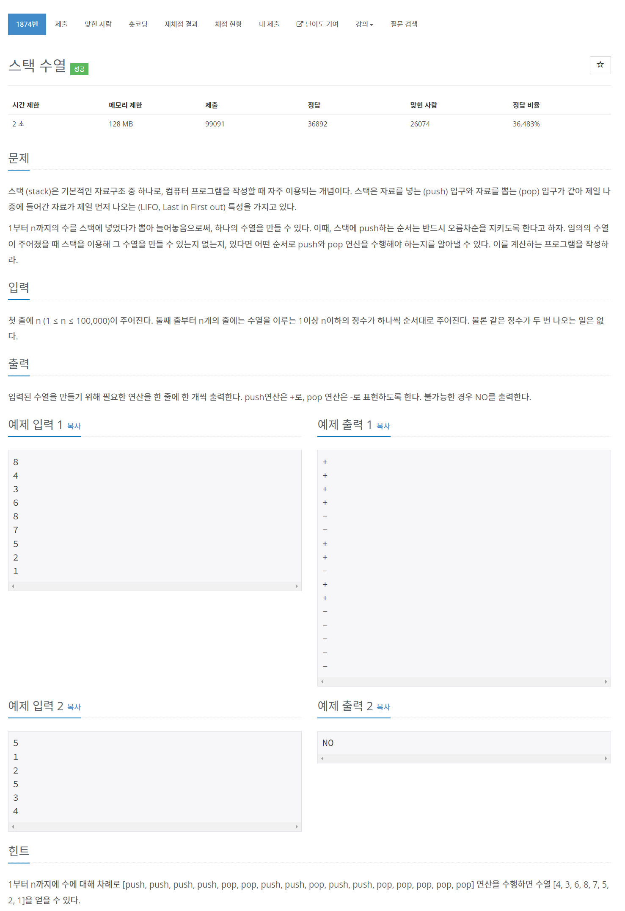

# [1874. 스택 수열](https://www.acmicpc.net/problem/1874)




### My Answer

```python
import sys

input = sys.stdin.readline

n = int(input())

arr = [int(input()) for _ in range(n)][::-1]
stack = []
top=n
res = []
for x in arr : 
    stack.append(x)
    res.append('-')
    
    while stack and top==stack[-1] : 
        res.append('+')
        stack.pop()
        top-=1
    
if len(stack)==0 :
    for x in res[::-1] : 
        print(x)
else : 
    print("NO")
```

* Time Complexity : O(n)
* Space Complexity : O(n)


### The things I got
