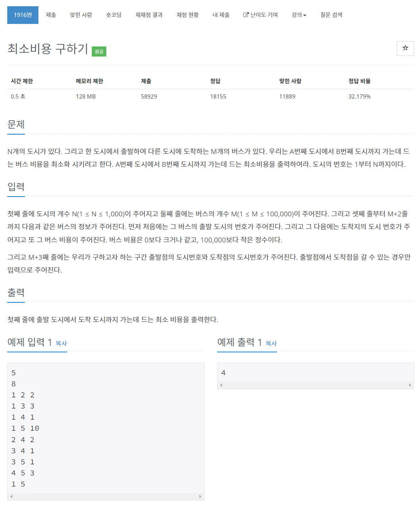

# [1916. 최소비용 구하기](https://www.acmicpc.net/problem/1916)




### My Answer

```python
import heapq
import sys

input = sys.stdin.readline

N = int(input())
M = int(input())
G = {i:{} for i in range(1,N+1)}

for _ in range(M) : 
    start,end,w = list(map(int, input().split()))
    if end not in G[start] or (end in G[start] and G[start][end] > w) : 
        G[start][end]=w

src, dest = list(map(int, input().split()))

INF = float('inf')
visited = [INF for _ in range(N+1)]

heap = []
heapq.heappush(heap,(0,src))

while heap : 
    w, now = heapq.heappop(heap)
    if visited[now]<=w : continue
    visited[now]=w
    
    for near in G[now] : 
        heapq.heappush(heap,(w+G[now][near],near))
        
print(visited[dest])
```

* Time Complexity : O(Elog(E))
* Space Complexity : O(E)


### The things I got
