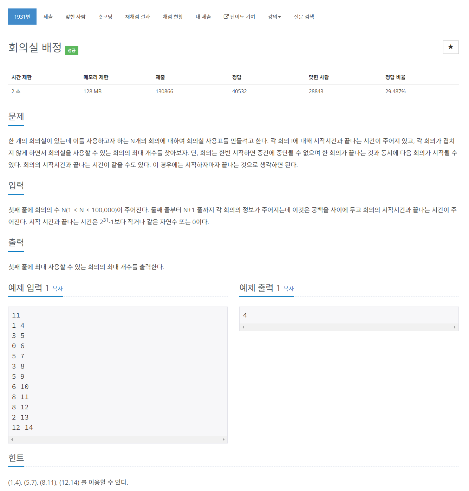

# [1931. 회의실 배정](https://www.acmicpc.net/problem/1931)




### My Answer

```python
import heapq
import sys

input = sys.stdin.readline

N = int(input())
meetings = [list(map(int,input().split())) for _ in range(N)]
res = []

heap = []

for x in meetings : 
    heapq.heappush(heap,(x[1],x[0]))
    
last_end = 0
res = 0
while heap : 
    end, start = heapq.heappop(heap)
    #start *= -1
    
    if last_end > start : 
        continue
    
    last_end = end
    res+=1

print(res)
```

* Time Complexity : O(nlogn)
* Space Complexity : O(n)


### The things I got
