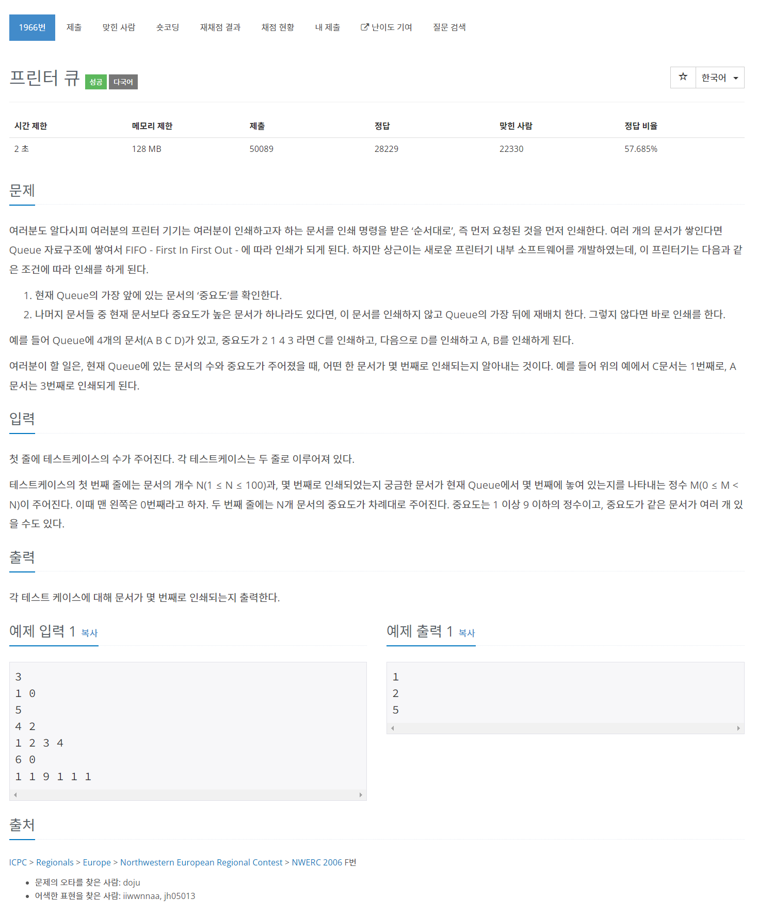

# [1966. 프린터 큐](https://www.acmicpc.net/problem/1966)




### My Answer

```python
from collections import deque
import heapq

for _ in range(int(input())) : 
    N,M = map(int,input().split())
    queue = list(map(int,input().split()))
    heap = []
    
    for x in queue : 
        heapq.heappush(heap,-x)

    deq = deque()
    for i,x in enumerate(queue) : 
        deq.append((i,x))
    
    res = 0
    count = 1
    while deq : 
        i,x = deq.popleft()
        if x==-heap[0] : 
            if i==M : 
                res = count
                break
            heapq.heappop(heap)
            count+=1
        else : 
            deq.append((i,x))
        i+=1
            
    print(res)
```

* Time Complexity : O(N^2)
* Space Complexity : O(N)


### The things I got
