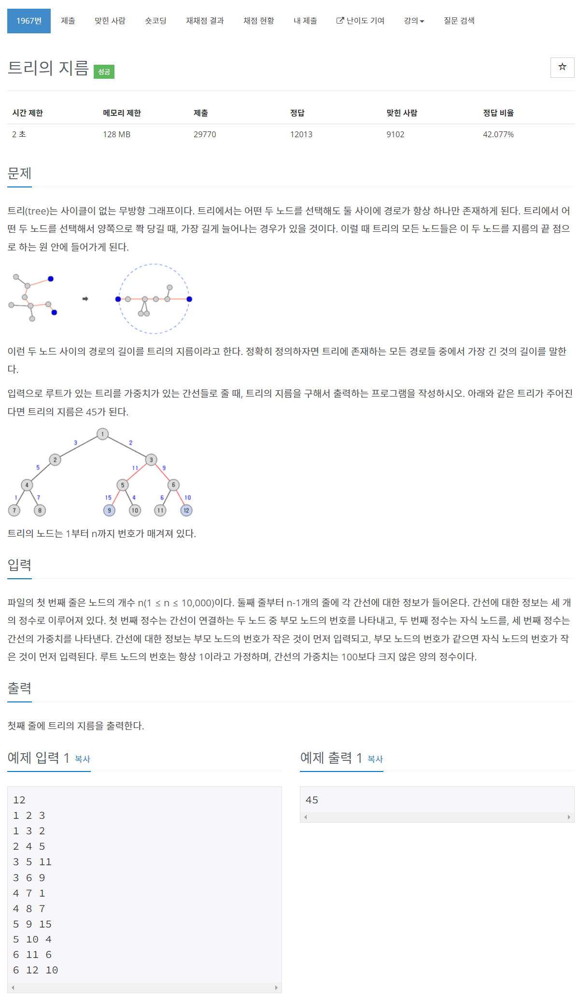

# [1967. 트리의 지름](https://www.acmicpc.net/problem/1967)




### My Answer

```python
import sys
sys.setrecursionlimit(100000)

input = sys.stdin.readline
n = int(input())
T = {i:{} for i in range(1,n+1)}

for _ in range(n-1) : 
    a,b,w = list(map(int, input().split()))
    T[a][b]=w

res = 0
def dfs(node) : 
    global res
    if not T[node] : return 0
    childs = [dfs(child)+T[node][child] for child in T[node]]
    first = max(childs)
    childs.remove(first)
    second = max(childs) if childs else 0
    
    res = max(res, first+second)
    return first

dfs(1)
print(res)
```

* Time Complexity : O(n)
* Space Complexity : O(2n)


### The things I got
