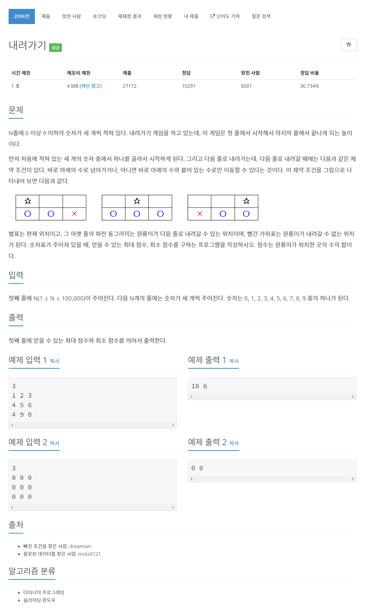

# [2096. 내려가기](https://www.acmicpc.net/problem/2096)




### My Answer

```python
import sys

input = sys.stdin.readline

min1,min2,min3 = 0,0,0
max1,max2,max3 = 0,0,0

for _ in range(int(input())) : 
    a,b,c = list(map(int,input().split()))
    min1, min2, min3 = a+min(min1,min2), b+min(min1,min2,min3), c+min(min2,min3)
    max1, max2, max3 = a+max(max1,max2), b+max(max1,max2,max3), c+max(max2,max3)
    
print(max(max1,max2,max3), min(min1,min2,min3))
```

* Time Complexity : O(n)
* Space Complexity : O(1)


### The things I got
