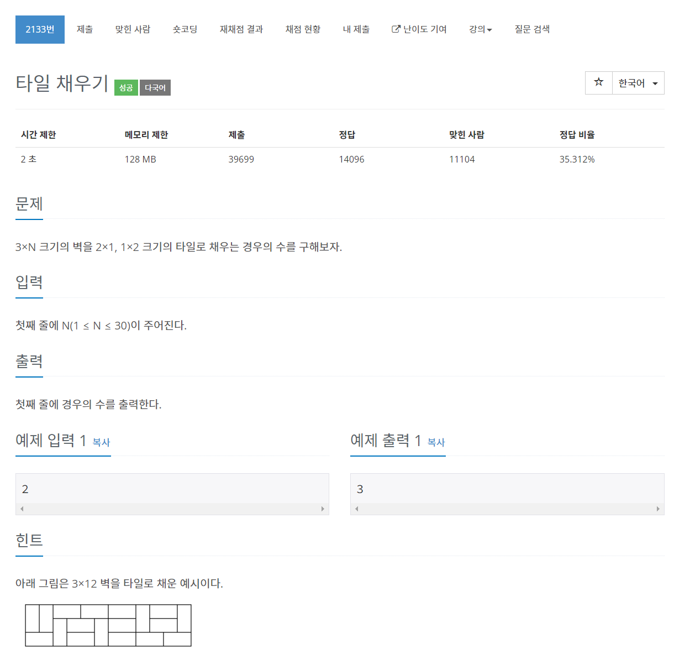

# [2133. 타일 채우기](https://www.acmicpc.net/problem/2133)




### My Answer

```python
n = int(input())
if n%2 : print(0)
else : 
    dp = [1]
    for i in range(2,n+1,2) : 
        temp = dp[-1]*3
        for x in dp[:-1] : 
            temp += x*2
        dp.append(temp)
    print(dp[-1])
```

* Time Complexity : O(n^2)
* Space Complexity : O(n)


### The things I got
