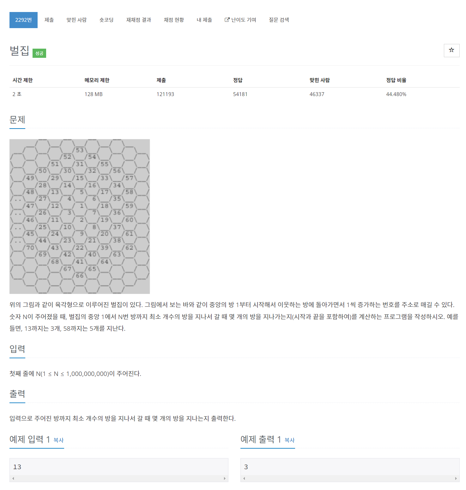

# [2292. 벌집](https://www.acmicpc.net/problem/2292)




### My Answer

```python
target = int(input())
val = 1
n = 1
while val<target : 
    val += 6*n
    n += 1

print(n)
```

* Time Complexity : O(n^-2)
* Space Complexity : O(1)


### The things I got
