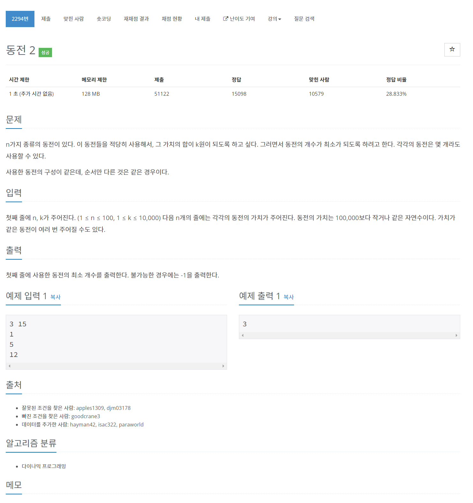

# [2294. 동전 2](https://www.acmicpc.net/problem/2294)




### My Answer

```python
n,k = map(int,input().split())
coins = [int(input()) for _ in range(n)]

dp = [-1]*(k+1)
for x in coins : 
    if x>k : continue
    dp[x]=1
    for i in range(x,k+1) : 
        if dp[i-x]!=-1 : 
            if dp[i]==-1 : 
                dp[i]=dp[i-x]+1
            else : 
                dp[i] = min(dp[i],dp[i-x]+1)
    print(dp)

print(dp[-1])
```

* Time Complexity : O(n*k)
* Space Complexity : O(k)


### The things I got
