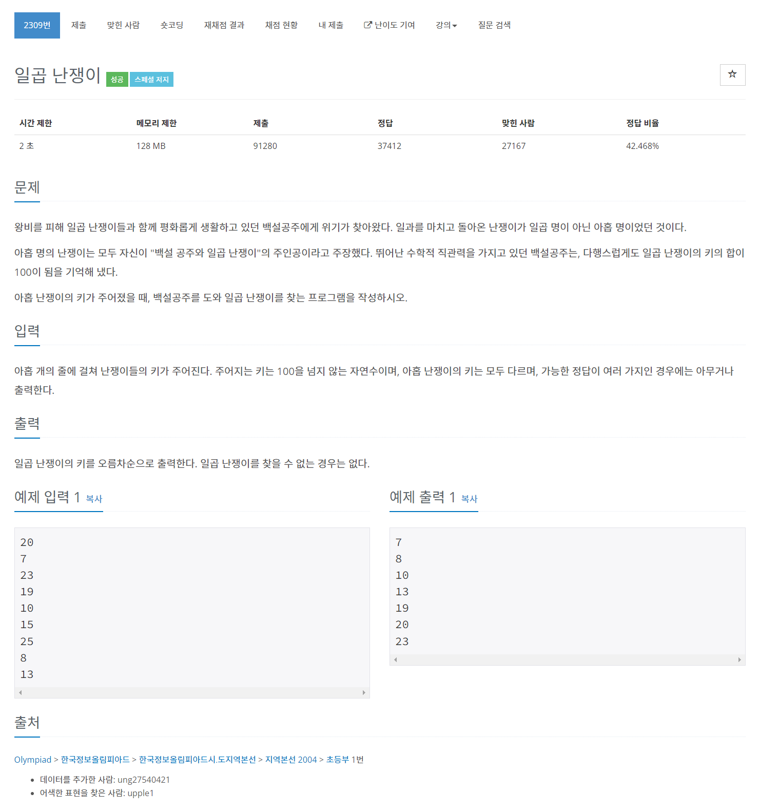

# [2309. 일곱 난쟁이](https://www.acmicpc.net/problem/2309)




### My Answer

```python
dwarfs = [int(input()) for _ in range(9)]

def findSeven(dwarfs) : 
    total = sum(dwarfs)
    for i in range(9) : 
        total-=dwarfs[i]
        for j in range(i+1,9) : 
            total-=dwarfs[j]
            if total==100 : 
                del dwarfs[j]
                del dwarfs[i]
                return dwarfs
            total+=dwarfs[j]
        total+=dwarfs[i]
        
for x in sorted(findSeven(dwarfs)) : 
    print(x)
```

* Time Complexity : O(n^2)
* Space Complexity : O(1)


### The things I got
