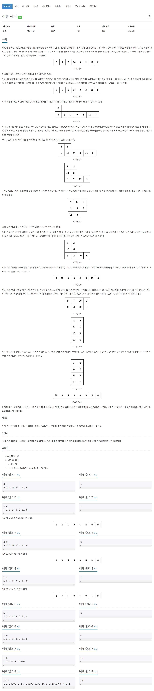

# [23291. 어항정리](https://www.acmicpc.net/problem/23291)




### My Answer

```python
N, K = map(int, input().split())
arr = list(map(int, input().split()))

def isMinMaxUnder_k(arr,k) : 
    return (max(arr)-min(arr)) <= k

def pushMinBowlsFish(arr) : 
    x = min(arr)
    for i in range(len(arr)) :
        if arr[i]==x : 
            arr[i]+=1
    return

def accumulateBowl(arr) : 
    
    # template for accumulation
    temp = [arr]+[[0 for _ in range(len(arr))] for _ in range(len(arr)-1)]
    
    # Init step
    temp[1][-2], temp[0][-1] = temp[0][-1],0
    
    while True : 
        
        i, count = 0,0
        start_j=0
        for j in range(len(temp[0])-1,-1,-1) : 
            if temp[0][j]==0 : continue # ignore empty value
            if temp[1][j]==0 : # if no bowls over 2, break
                start_j=j
                break
        
        while i<len(temp) and temp[i][start_j+1] : 
            count+=1
            i+=1

        if count > start_j+1 : return temp
        
        # Step 1 : Gather
        groups = []
        start_j=len(temp[0])-1
        for j in range(len(temp[0])-1,-1,-1) : 
            if temp[0][j]==0 : continue # ignore empty value
            if temp[1][j]==0 : # if no bowls over 2, break
                start_j=j
                break
            
            # ready for get vertical elements
            verticals = []
            i=0
            while i<len(temp) and temp[i][j] : 
                verticals.append(temp[i][j])
                temp[i][j]=0
                i+=1
                
            groups.append(verticals)
            
        # Exit Condition
        if len(groups[0]) > start_j+1 : return temp

        # Step 2 : Rotate
        rotated = groups[::-1]

        # Step 3 : Adjust
        for i in range(len(rotated)) : 
            for j in range(len(rotated[0])) : 
                temp[1+i][start_j-j]=rotated[i][j]
            
    return temp

def simultaneouslyAdjustFish(temp) : 
    ori = [x[:] for x in temp]
    v = (1,-1,0,0)
    h = (0,0,1,-1)
    for i in range(len(ori)) : 
        for j in range(len(ori[0])) : 
            if ori[i][j]==0 : continue
            for k in range(4) : 
                ni,nj = i+v[k],j+h[k]
                if not(0<=ni<len(ori)) or not(0<=nj<len(ori[0])) : continue
                if ori[ni][nj]==0 or ori[i][j]-ori[ni][nj]<5 : continue
                    
                x = (ori[i][j]-ori[ni][nj])//5
                temp[ni][nj]+=x
                temp[i][j]-=x
    return temp

def flattenBowls(temp) : 
    res = []
    for j in range(len(temp[0])) : 
        if temp[0][j]==0 : break
        verticals = []
        i=0
        while i<len(temp) and temp[i][j] : 
            verticals.append(temp[i][j])
            i+=1
        res += verticals[::-1]
    return res

def overlapBowls(arr) : 
    n = len(arr)
    first_flip = [arr[:n//2],arr[n//2:][::-1]]
    n = len(first_flip[0])
    second_flip = [x[:n//2] for x in first_flip]+[x[n//2:][::-1] for x in first_flip][::-1]
    return second_flip

def moveBowls(arr, k) : 
    # reverse for ease implementation
    arr = arr[::-1]
  
    count=0
    while not isMinMaxUnder_k(arr, k) : 
        pushMinBowlsFish(arr)
        
        temp = accumulateBowl(arr)
        temp = simultaneouslyAdjustFish(temp)
        arr = flattenBowls(temp)
        
        temp = overlapBowls(arr)        
        temp = simultaneouslyAdjustFish(temp)
        arr = flattenBowls(temp)
        count+=1
    return count
    
print(moveBowls(arr,K))
```

* Time Complexity : O((max-min)*n)
* Space Complexity : O(n*2)


### The things I got
