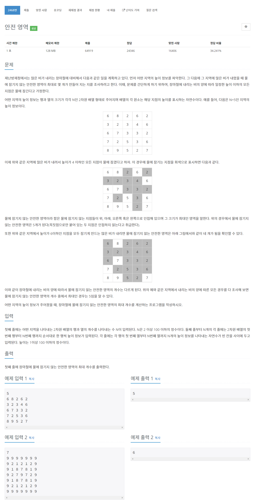

# [2468. 안전 영역](https://www.acmicpc.net/problem/2468)




### My Answer

```python
import sys
sys.setrecursionlimit(10000)
input = sys.stdin.readline

n= int(input())
arr = [list(map(int,input().split())) for _ in range(n)]

def dfs(arr, i, j, height) : 
    v = (1,-1,0,0)
    h = (0,0,1,-1)
    for k in range(4) : 
        ni,nj = i+v[k], j+h[k]
        if ni<0 or nj<0 or ni>=len(arr) or nj>=len(arr[0]) or arr[ni][nj]<=height : continue
        arr[ni][nj]=0
        dfs(arr,ni,nj,height)
    return 

res = 1
M = max(max(x) for x in arr)
for h in range(1,M) : 
    count=0
    temp = [x[:] for x in arr]
    for i in range(len(temp)) : 
        for j in range(len(temp[0])) : 
            if temp[i][j]<=h : continue
            dfs(temp,i,j,h)
            count+=1
    res = max(res,count)
    
print(res)
```

* Time Complexity : O(M*n^2)
* Space Complexity : O(n^2)


### The things I got
