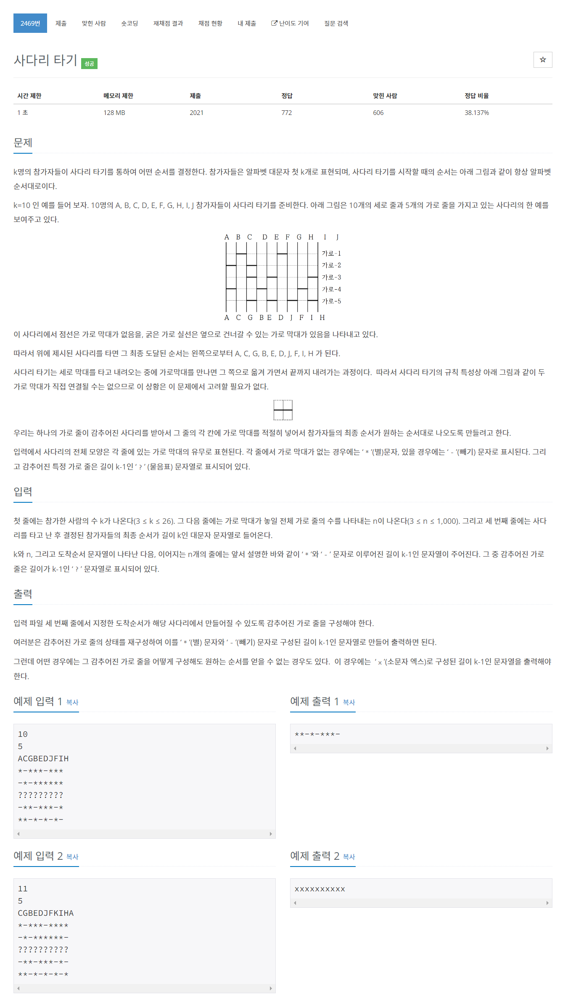

# [2469. 사다리 타기](https://www.acmicpc.net/problem/2469)




### My Answer

```python
def climb(seq, ladder) : 
    seq = list(seq)
    for x in ladder : 
        
        i=0
        res = []
        while 0<=i<len(x) : 
            #print(res)
            if x[i] =='*' : 
                res.append(seq[i])
                i+=1
            else : 
                res.append(seq[i+1])
                res.append(seq[i])
                i+=2
                
        if len(res)!=len(seq) : 
            res.append(seq[-1])
        
        seq = res
    return seq

k = int(input())
n = int(input())
participants = [chr(i+65) for i in range(k)]
final = input()
ladder = [input() for _ in range(n)]
pivot = ladder.index('?'*(k-1))
if pivot==n-1 : #last
    upper, lower = ladder[:-1],[]
else : 
    upper, lower = ladder[:pivot],ladder[pivot+1:]
    
start = climb(participants, upper)
end = climb(final, lower[::-1])

#print("start",start)
#print("end",end)

res = []
already=False
makable=True
for i in range(k-1) : 
    if already : 
        res.append("*")
        already=False
    elif start[i]==end[i] : 
        res.append("*")
    elif start[i]==end[i+1] and start[i+1]==end[i] : 
        res.append("-")
        already=True
    else : 
        makable = False
        break
        
for i in range(len(res)-1) : 
    if res[i]=='-' and res[i+1]=='-' : 
        makable=False
            
if not makable : 
    res = ['x']*(k-1)
    
print(''.join(res))
```

* Time Complexity : O(nk)
* Space Complexity : O(n)


### The things I got
