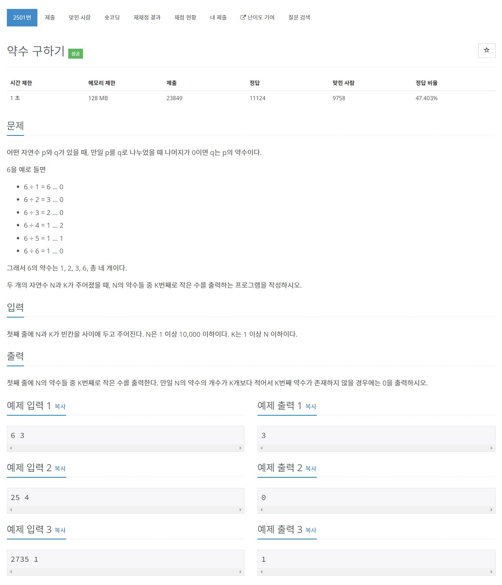

# [2501. 약수 구하기](https://www.acmicpc.net/problem/2501)




### My Answer

```python
N, K = map(int, input().split())

def divisors(N,K) : 
    count=1
    for i in range(1,N+1) : 
        if N%i : continue
        if count==K : 
            return i
        count+=1
    return 0

print(divisors(N,K))
```

* Time Complexity : O(n)
* Space Complexity : O(1)


### The things I got
