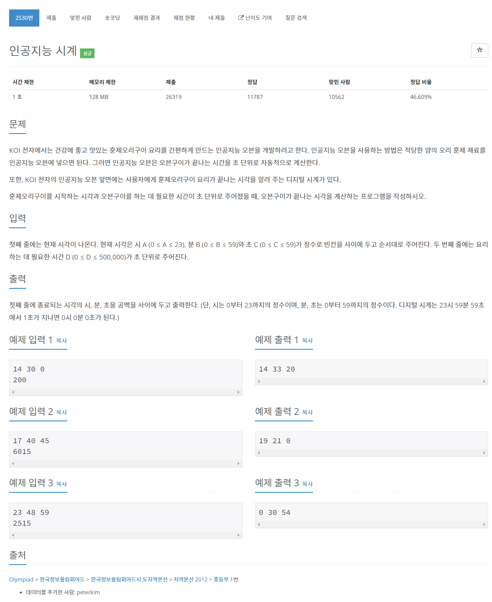

# [2530. 인공지능 시계](https://www.acmicpc.net/problem/2530)




### My Answer

```python
h,m,s = map(int, input().split())
d = int(input())

total = h*3600+m*60+s
total+=d
total%=86400

h = total//3600

print(total//3600, (total%3600)//60, (total%3600)%60)
```

* Time Complexity : O(1)
* Space Complexity : O(1)


### The things I got
