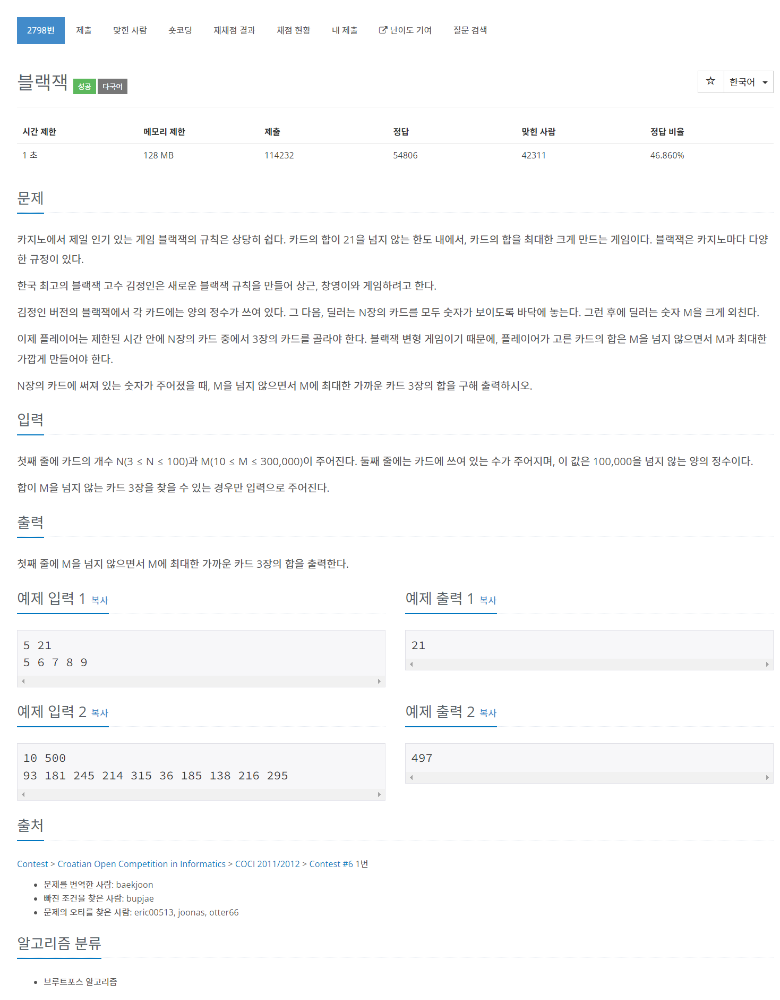

# [7898. 블랙잭](https://www.acmicpc.net/problem/2798)




### My Answer

```python
import sys

def getMinGap(arr,target) : 
    #print("arr :",arr,"// target :",target)
    l,r = 0,len(arr)-1
    min_gap = target
    while l<r : 
        if arr[l]+arr[r]<=target : 
            gap = target-(arr[l]+arr[r])
            min_gap = min(min_gap,gap)
            l+=1
        else : 
            r-=1
    #print("min_gap :",min_gap)
    return min_gap


N,M = map(int,input().split())
cards = list(map(int,input().split()))
cards.sort()
targets = [M-x for x in cards]
#print("cards",cards)
#print("targets",targets)

res = sys.maxsize
for i in range(len(cards)-1) : 
    res = min(getMinGap(cards[:i]+cards[i+1:],targets[i]),res)
    
res = min(getMinGap(cards[:-1],targets[-1]),res)
print(M-res)
```

* Time Complexity : O(n^2)
* Space Complexity : O(n)


### The things I got
