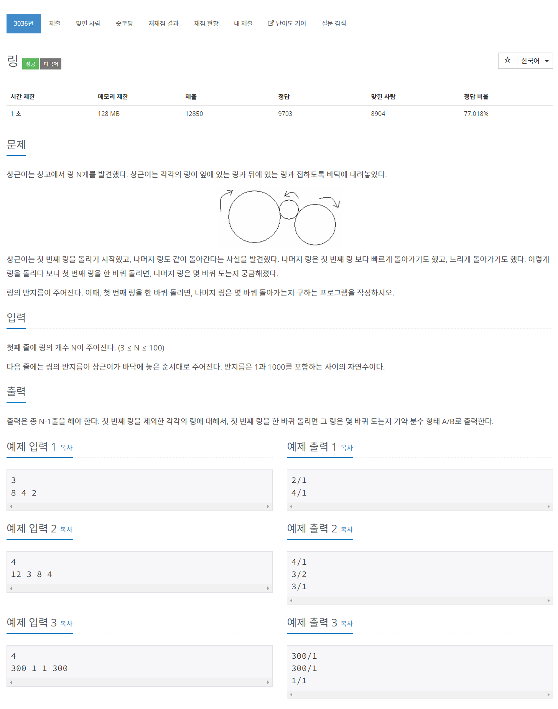

# [3036. 링](https://www.acmicpc.net/problem/3036)




### My Answer

```python
def findGCD(a,b) : 
    k = min(a,b)
    res = 1
    for i in range(2,k+1) : 
        if a%i==0 and b%i==0 : res=i
    return res

_, arr = input(), list(map(int,input().split()))
first, others = arr[0], arr[1:]
for x in others : 
    gcd = findGCD(first,x)
    print("{}/{}".format(first//gcd,x//gcd))
```

* Time Complexity : O(n*r)
* Space Complexity : O(1)


### The things I got
