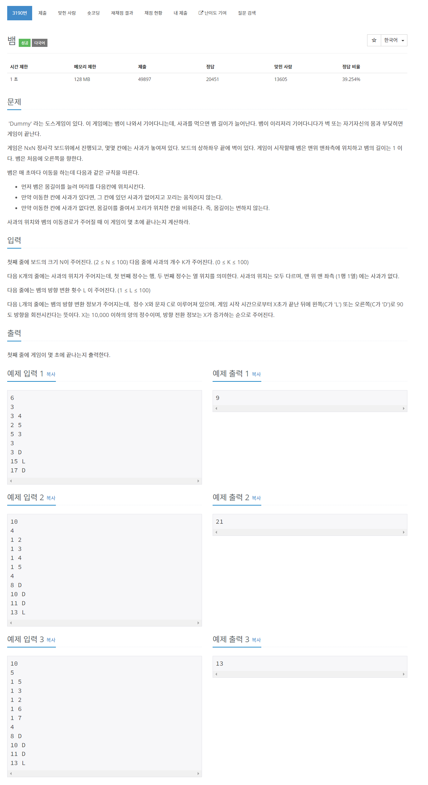

# [3190. 뱀](https://www.acmicpc.net/problem/3190)




### My Answer

```python
import sys
from collections import deque

def getInput() : 
    input = sys.stdin.readline
    N = int(input())
    K = int(input())
    Apples = set([tuple(map(int, input().split())) for _ in range(K)])
    L = int(input())
    Paths = [tuple(input().split()) for _ in range(L)]
    
    return N,Apples,Paths

def stepForwardByDirection(i,j,direction) : 
    '''
    Direction
    ---------------
      0 : right
      1 : down
      2 : left
      3 : up
    '''
    
    if direction==0 : 
        return i,j+1
    elif direction==1 : 
        return i+1,j
    elif direction==2 : 
        return i,j-1
    elif direction==3 : 
        return i-1,j
    else :
        raise(Exception("Wrong direction type"))

def goHead(snake_q, snake_set, head_direction) : 
    
    if len(snake_q)==0 : 
        raise(Exception("No snake?!"))
    
    # create new head
    new_position = stepForwardByDirection(*snake_q[0],head_direction)
    snake_q.appendleft(new_position)
    
    return new_position
    
def updateSnake(snake_q, snake_set, expand=False) : 
        
    # update set of snake
    snake_set.add(snake_q[0])
    
    # if snake meet apple, do not remove tail
    if expand==True : 
        return 
    
    # else snake cannot meet apple, remove tail
    removed = snake_q.pop()
    snake_set.remove(removed)
    return 
    
def isGameEnd(N,i,j,snake_set) : 
    # when snake meet wall
    if i<1 or i>N or j<1 or j>N : 
        return True
    
    # when snake meet himself
    if (i,j) in snake_set : 
        return True
    
    return False

def newDirection(head_direction,new_direction) : 
    '''
    L(turn left) : -1 
    D(turn right) : +1  
    '''
    if new_direction=="L" : 
        return (head_direction-1)%4
    elif new_direction=="D" : 
        return (head_direction+1)%4
    else : 
        raise(Exception("Wrong Direction type : it should be L or D"))
        return 

def DummyGame(N,Apple,Paths) : 
    '''
    [Direction]
     0 : right
     1 : down
     2 : left
     3 : up
     
     L(turn left) : -1 
     D(turn right) : +1  
    '''
    path_q = deque(Paths)
    
    # init state
    snake_q = deque([(1,1)])
    snake_set = set([(1,1)])
    head_direction = 0
    
    # for every time
    for now in range(1,10000) : 
        
        # go forward as head's direction
        i,j = goHead(snake_q, snake_set, head_direction)
        
        # check game end state
        if isGameEnd(N,i,j,snake_set) : 
            return now
        
        # if head meet apple
        if (i,j) in Apple : 
            Apple.remove((i,j))
            updateSnake(snake_q,snake_set,expand=True)
        else : 
            updateSnake(snake_q,snake_set)
    
        # when job end and if direction changes, apply to head
        if path_q and int(path_q[0][0])==now : 
            head_direction = newDirection(head_direction, deque.popleft(path_q)[1])
    
N,Apples,Paths = getInput()
print(DummyGame(N,Apples,Paths))
```

* Time Complexity : O(n)
* Space Complexity : O(n)


### The things I got
